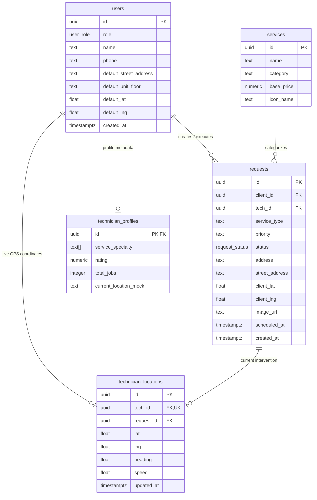
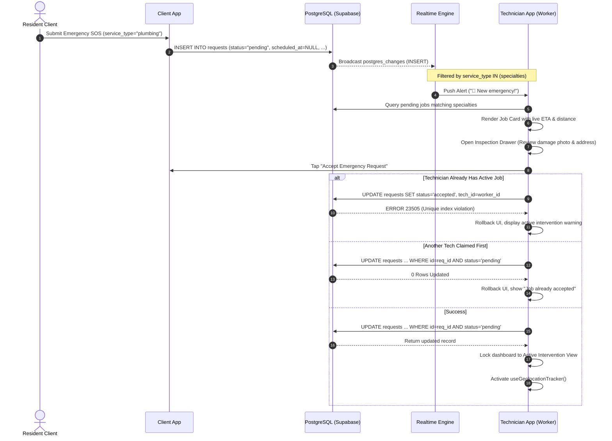
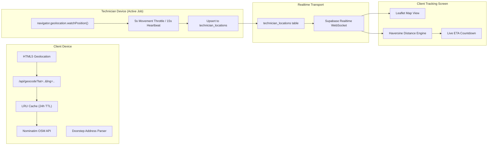
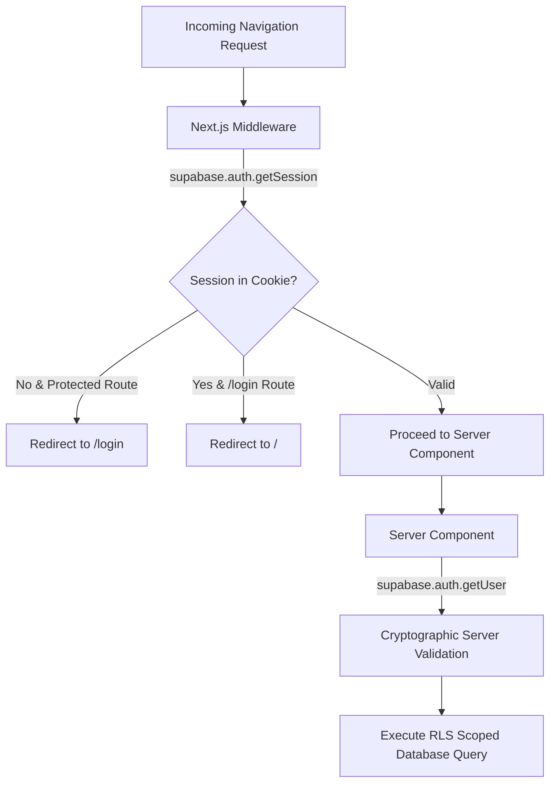
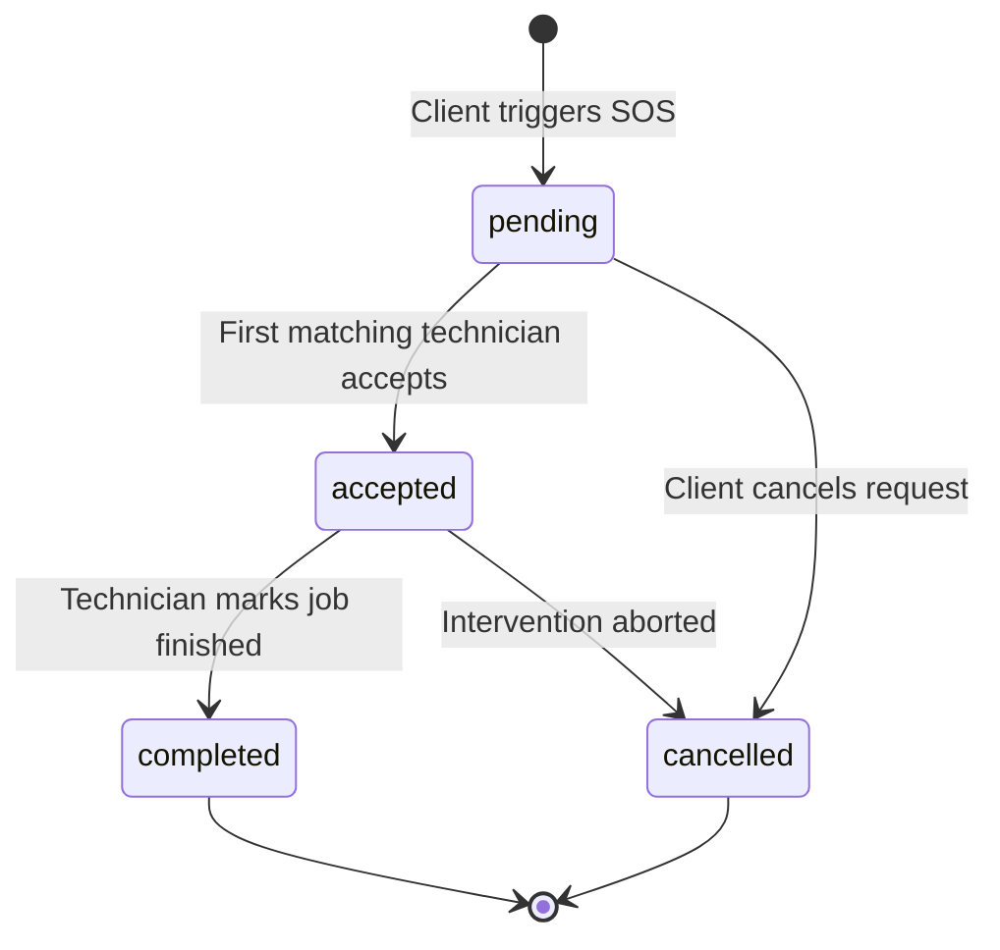
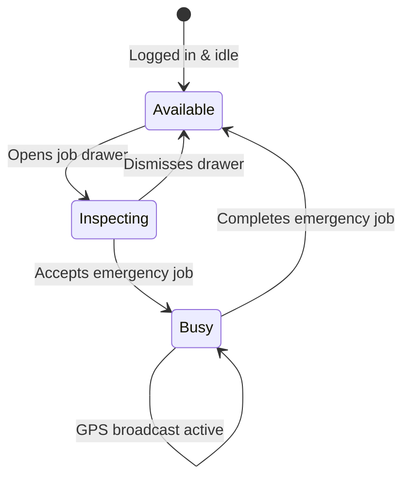

# SewaSync System Architecture: Backend, Worker Triage, and Geolocation

This document details the architectural foundation of the SewaSync platform, covering the backend data infrastructure, technician triage workflows, concurrency controls, and real-time geolocation systems.

---

## 1. High-Level System Architecture

SewaSync is organized as a decoupled monorepo powered by Next.js 16 (App Router) on the frontend and Supabase (PostgreSQL 15, PostgREST, GoTrue Auth, Realtime WebSockets, and Storage) on the backend.

```mermaid
flowchart TD
    subgraph ClientsApp ["Client Web App (apps/clients)"]
        SOS["SOS Emergency Triage"]
        Book["Scheduled Bookings"]
        ClientTracking["Live Tracking Map"]
        GeocodeAPI["/api/geocode (LRU Cache)"]
    end

    subgraph SupabaseBackend ["Supabase Backend Infrastructure"]
        Auth["GoTrue Auth & Cookie Sessions"]
        Postgres[("PostgreSQL Database")]
        Realtime["Realtime WebSocket Server"]
        Storage["Storage Bucket (sos-images)"]
    end

    subgraph TechApp ["Technician Console (apps/technician)"]
        TechBoard["Multi-Specialty Dispatch Board"]
        Inspection["Pre-Acceptance Inspection Drawer"]
        ActiveJob["Active Intervention View"]
        GPSTracker["Background Geolocation Broadcaster"]
        ExtMaps["Google Maps Navigation Link"]
    end

    SOS -->|1. Insert Emergency Request| Postgres
    SOS -->|Upload photo| Storage
    Book -->|Insert Scheduled Request| Postgres
    GeocodeAPI <-->|Forward / Reverse Lookup| OSM["OpenStreetMap Nominatim"]

    Postgres -->|Broadcast INSERT/UPDATE| Realtime
    Realtime -->|Push Matching Job Alert| TechBoard

    TechBoard -->|Inspect Details| Inspection
    Inspection -->|Accept Job (Status: accepted)| Postgres
    
    ActiveJob -->|Start Tracking| GPSTracker
    GPSTracker -->|Upsert Coordinates| Postgres
    Postgres -->|Broadcast Location Update| Realtime
    Realtime -->|Stream Live Coordinates| ClientTracking

    ActiveJob -->|Launch Turn-by-Turn| ExtMaps
```

### Key Architectural Principles
- **Decoupled Monorepo**: `apps/clients` and `apps/technician` run as independent Next.js applications sharing no runtime node dependencies. They communicate solely through Supabase database states, Realtime channels, and storage buckets.
- **Data-Layer Enforcement**: Business invariants (single active intervention per technician, category bounds, rating limits) are enforced at the PostgreSQL database layer using check constraints, foreign keys, and partial unique indexes.
- **Zero-Network Middleware Route Protection**: Middleware checks session tokens locally from cookies via `supabase.auth.getSession()` without issuing blocking HTTPS requests, leaving cryptographic verification (`supabase.auth.getUser()`) for Server Components.

---

## 2. Backend Data Layer & Database Schema

The platform relies on 6 core tables in the `public` schema:



### Table Specifications

#### 1. `public.users`
Stores shared profile identity for both resident clients and service professionals.
- `role`: Enum (`'client'`, `'technician'`).
- `name`: User full name or initial contact handle.
- `phone`: Mobile number utilized for direct dispatch calls and WhatsApp communications.
- `default_street_address` & `default_unit_floor`: Resident saved address profile fields automatically prefilled into subsequent emergency triage flows.
- `default_lat` & `default_lng`: Saved geographic coordinates for instant dispatch lookup.

#### 2. `public.technician_profiles`
Maintains operational capabilities and performance metrics for technicians.
- `service_specialty`: Array of text tags (`text[]`) constrained between 1 and 4 specialties (`CHECK (array_length(service_specialty, 1) BETWEEN 1 AND 4)`).
- `rating`: Decimal rating from 0.0 to 5.0.
- `total_jobs`: Completed intervention counter.

#### 3. `public.requests`
The core transactional entity representing both emergency SOS calls and scheduled appointments.
- `status`: Enum (`'pending'`, `'accepted'`, `'completed'`).
- `priority`: Urgent triage level (`'high'`, `'medium'`, `'low'`).
- `scheduled_at`: Nullable timestamp. When `NULL`, the request is an instantaneous Emergency SOS. When populated, it represents a future scheduled service.
- `address`: Complete doorstep delivery address (flat number, society name, landmark, and sector).
- `street_address`: Stripped road and locality string optimized for navigation software.
- `client_lat` & `client_lng`: Precise GPS coordinates captured at the moment of request creation.
- `image_url`: Public Supabase Storage URL pointing to resident damage photos.

#### 4. `public.technician_locations`
Ephemeral table for live geolocation tracking.
- `tech_id`: Unique foreign key referencing `users.id` (`UNIQUE (tech_id)`).
- `request_id`: Active request foreign key (`ON DELETE SET NULL`).
- `lat` & `lng`: Live latitude and longitude broadcast from device GPS.
- `heading` & `speed`: Direction of travel in degrees and velocity in m/s.
- `updated_at`: Timestamp refreshed on every position ping.

#### 5. `public.services`
Catalog of supported services containing baseline pricing (e.g. Plumbing, Electrical, AC Repair, Locksmith) used for upfront pricing transparency.

---

## 3. Database Indexes & Query Optimization

To maintain sub-100ms response times under high concurrency, targeted B-tree composite and partial indexes are configured:

| Index Name | Target Table | Definition | Operational Purpose |
|---|---|---|---|
| `requests_emergency_dispatch_idx` | `requests` | `(status, service_type, created_at desc) WHERE scheduled_at IS NULL` | Accelerates real-time dispatch triage feeds for incoming emergencies without scanning scheduled rows. |
| `requests_one_active_job_per_technician` | `requests` | `(tech_id) WHERE status = 'accepted' AND scheduled_at IS NULL` | Database-enforced partial unique constraint guaranteeing a technician can hold at most 1 active emergency job. |
| `requests_booking_filter_idx` | `requests` | `(scheduled_at, status, tech_id, service_type)` | Powers scheduled booking tab navigation, date filters, and badge counters. |
| `requests_client_history_idx` | `requests` | `(client_id, created_at desc)` | Eliminates disk sort passes on client service history feeds. |
| `requests_tech_history_idx` | `requests` | `(tech_id, status, created_at desc)` | Instant technician earnings and completed job history retrieval. |
| `technician_locations_tech_idx` | `technician_locations` | `(tech_id)` | Real-time upsert and tracking query acceleration. |

---

## 4. Worker (Technician) Triage Architecture

The triage system coordinates incoming client emergencies with available technicians based on certified skills, active workload, and proximity.



### Triage Logic Breakdown

### 1. Skill-Based Real-Time Partitioning
Technicians register between 1 and 4 specialties during onboarding (e.g., Plumbing, Electrical, AC Repair). The technician console listens to a specialized Supabase Realtime channel:
```typescript
channel = supabase
  .channel(`technician-requests-${specialtyKey}`)
  .on(
    "postgres_changes",
    {
      event: "*",
      schema: "public",
      table: "requests",
      filter: `service_type=in.(${specialtyKey})`,
    },
    (payload) => {
      // Re-fetch pending jobs and alert technician
    }
  )
  .subscribe()
```
Technicians never receive network noise or alerts for job categories outside their certified skill set.

### 2. The Single-Job Concurrency Lock
In an emergency dispatch system, technician availability must be strictly atomic. SewaSync enforces concurrency control at two levels:

1. **Database Layer (Partial Unique Index)**:
   ```sql
   CREATE UNIQUE INDEX requests_one_active_job_per_technician
     ON public.requests (tech_id)
     WHERE status = 'accepted' AND scheduled_at IS NULL;
   ```
   Even if a technician opens multiple browser tabs or double-clicks an action button, PostgreSQL rejects any second concurrent assignment with error code `23505`.

2. **Atomic Row-Level Matching**:
   ```typescript
   const { data, error } = await supabase
     .from("requests")
     .update({ status: "accepted", tech_id: technicianId })
     .eq("id", job.id)
     .eq("status", "pending")
     .select()
     .maybeSingle()
   ```
   If two technicians click accept simultaneously on the same emergency, only one update matches `status = 'pending'`. The second technician receives 0 rows, prompting an immediate UI rollback.

### 3. Pre-Acceptance Inspection Drawer
Before accepting, technicians review:
- Client name and contact handle.
- Uploaded photographic evidence of the issue.
- Specific client instructions or hazard notes.
- Estimated distance and driving travel time.
- Exact doorstep location.

### 4. Scheduled Appointments vs. Emergency SOS
- **Emergency SOS (`scheduled_at IS NULL`)**: Subject to the strict single-job concurrency lock. Technicians cannot accept a second emergency while actively dispatched.
- **Scheduled Bookings (`scheduled_at IS NOT NULL`)**: Technicians can review and accept multiple upcoming bookings for future dates. They appear in the dedicated "Booking List" console organized by schedule ETA.

---

## 5. Geolocation, Geocoding, and Live Tracking Architecture

The geolocation pipeline connects resident addresses with technician field movement through coordinate resolution, spatial distance calculations, and real-time GPS broadcasting.



### 1. In-Memory Geocode Caching Engine (`/api/geocode`)
Geocoding converts raw latitude/longitude coordinates to readable Indian addresses and vice-versa. To prevent upstream rate limits and avoid repetitive latency, `apps/clients/app/api/geocode/route.ts` implements a multi-tier LRU cache:
- **Coordinate Bucketing**: GPS coordinates are rounded to 4 decimal places (approximately 11 meters resolution). Nearby GPS jitter hits the exact same cache key.
- **Query Fragment Normalization**: Address search strings are sanitized, lowercased, and cached.
- **Cache Parameters**: Max 1,000 entries with a 24-hour Time-To-Live (TTL). Cached lookups resolve in 0ms without hitting OpenStreetMap Nominatim servers.

### 2. Dual-Address Architecture
Navigation applications frequently fail when fed apartment, floor, or gate details. SewaSync splits address data into two specialized fields:
- **`address` (Doorstep Detail)**: Contains the full address (e.g. `Flat G-92, 2nd Floor, Ekanki Enclave, Sector Pi-2, Greater Noida`). Displayed in the technician inspection drawer for doorstep arrival.
- **`street_address` (Navigation Route)**: Contains strictly the road, sector, and city (e.g. `Ekanki Enclave, Sector Pi-2, Greater Noida`). Passed to external turn-by-turn navigation engines.

### 3. Address Deduplication & Normalization (`apps/clients/lib/address.ts`)
To prevent redundant address segments (such as repeating the house number or society name across multiple form fields), the address engine provides:
- `parseAddressToStructured()`: Separates flat number, society name, landmark, and sector. Automatically strips duplicate leading house tokens.
- `formatFullDoorstepAddress()`: Assembles the final technician address string, pruning identical adjacent segments and suppressing redundant building names if already present in the street description.

### 4. Background GPS Broadcast Pipeline (`useGeolocationTracker`)
When a technician accepts an emergency request, the tracker hook initializes:
1. **High-Accuracy Sensor Activation**: Starts `navigator.geolocation.watchPosition` with `enableHighAccuracy: true`.
2. **Throttled Updates**: Pings are throttled to once every 5 seconds during vehicle movement to preserve mobile device battery.
3. **Stationary Heartbeat**: A 15-second timer issues coordinate refreshes even when the technician is stopped at a traffic signal.
4. **Database Upsert**: Coordinates, speed, heading, and current request ID are upserted into `public.technician_locations`.
5. **Automatic Teardown**: Upon job completion or cancellation, the watch listener is cleared and the technician row in `technician_locations` is deleted.

### 5. Client Live Map & Distance Computation
On the resident tracking page (`apps/clients/app/tracking/[jobId]/page.tsx`):
- **WebSocket Channel**: Listens to changes on `technician_locations` filtered to the assigned technician ID.
- **Haversine Distance Formula**:
  $$\Delta\sigma = 2 \arcsin \left( \sqrt{\sin^2\left(\frac{\Delta\phi}{2}\right) + \cos(\phi_1)\cos(\phi_2)\sin^2\left(\frac{\Delta\lambda}{2}\right)} \right)$$
  $$d = R \cdot \Delta\sigma \quad (R = 6371\text{ km})$$
- **Dynamic ETA Engine**: Computes realistic urban travel times based on straight-line distance adjusted for an average city driving speed of 25 km/h:
  $$\text{ETA (minutes)} = \max\left(1, \, \text{round}\left(\frac{d}{25} \times 60\right)\right)$$
- **Proximity Milestones**:
  - Distance > 100 meters: "Technician on the way" with numerical ETA.
  - Distance <= 100 meters: Status updates to "Arriving at your doorstep now".

---

## 6. Security, RLS, and Authentication Flow

SewaSync uses GoTrue Authentication with role separation:



1. **Local Cookie Session Protection**:
   - `middleware.ts` in both applications uses `getSession()` to read and refresh sessions locally from cookies.
   - Eliminates 300ms to 600ms network roundtrips on route navigation while redirecting unauthorized requests instantly.
2. **Server Component Cryptographic Verification**:
   - Server Components execute `supabase.auth.getUser()` to validate the JWT against Supabase before sensitive data operations.
3. **Row Level Security (RLS)**:
   - Data access is governed by RLS policies on `requests`, `technician_profiles`, `technician_locations`, and `storage.objects`.

---

## 7. Operational State Machines

### Emergency Request Lifecycle


### Technician Availability State


---

## 8. Summary of Performance Best Practices Implemented
- **PostgREST Nested Joins**: Reduced tracking screen database roundtrips from 3 sequential queries to a single query joining `requests`, `users`, `technician_profiles`, and `technician_locations`.
- **Targeted Memoization**: `BookingCard` and `JobCard` components are isolated with `React.memo` custom equality comparators to prevent list-wide re-renders during state mutations.
- **Zero-CLS Skeletons**: Custom skeleton cards match real card geometry to eliminate Cumulative Layout Shift during data hydration.
- **Stable Realtime Channels**: Subscriptions normalize array dependencies to static sorted strings, preventing WebSocket reconnection thrashing.
