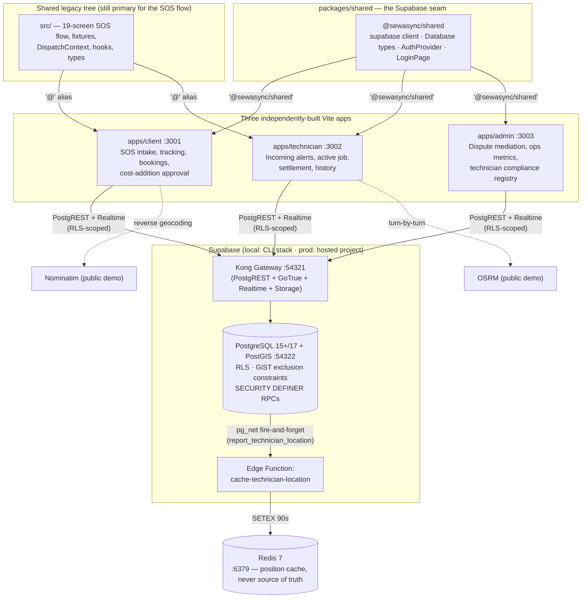

# SewaSync — Emergency Home Repair Cooperative Platform

[](.github/workflows/ci.yml)
[](.mise.toml)
[](.mise.toml)
[](tsconfig.json)
[](package.json)


## Table of Contents

1. [Overview](#1-overview)
2. [System Architecture](#2-system-architecture)
3. [Technology Stack — How & Why](#3-technology-stack--how--why)
4. [Core Domain Rules & Invariants](#4-core-domain-rules--invariants)
5. [Ports & Network Topology](#5-ports--network-topology)
6. [Local Setup & Quickstart](#6-local-setup--quickstart)
7. [Production Deployment Strategy](#7-production-deployment-strategy)
8. [Verification & CI/CD Pipeline](#8-verification--cicd-pipeline)
9. [Repository Layout Reference](#9-repository-layout-reference)
10. [Known Gaps & Technical Debt](#10-known-gaps--technical-debt)

---

## 1. Overview

**SewaSync** is a dispatch platform for emergency (SOS) and scheduled home-repair services, built around a **cooperative** relationship with the technicians who perform the work rather than a pure extraction model. Two design goals are held simultaneously and neither is allowed to erode the other:

- **For residents** (initial market: Greater Noida / Delhi NCR): a verifiable, sub-30-minute emergency dispatch, live technician tracking with a real ETA (not a spinner), transparent line-item pricing, and an approval gate before any price increase is charged.
- **For technicians**: a 1–3 category skill scope that keeps matching relevant rather than a slot-filling free-for-all, fatigue-aware dispatch eligibility instead of unlimited hours, Bayesian rating shrinkage so a single bad review from a low-volume client doesn't sink a career, and a tiered-liability/insurance model with a self-funded deposit alternative so formal insurance products don't become a barrier to entry for the informal workforce this platform exists to serve.

The mechanism for both is the same: **lifecycle state is server-authoritative and mutated only through `SECURITY DEFINER` RPCs**, concurrency invariants (single active job, non-overlapping calendar) are enforced by a single PostgreSQL `GiST EXCLUDE` constraint rather than application logic, and authorization is enforced by Postgres Row-Level Security rather than trusted to any of the three front-end surfaces.

### Status legend used throughout this document

| Label | Meaning |
|---|---|
| **Implemented** | Exists in a checked-in migration, RPC, or component right now — verifiable by reading the code |
| **Specified** | Designed and documented in [`docs/`](docs/) (thresholds, table shapes, RPC contracts) but not yet present in `supabase/migrations/` or app code |
| **Superseded** | An earlier design, still described in one committed doc, that the current filesystem has moved past |

---

## 2. System Architecture

### 2.1 Topology

The platform is a **pnpm workspace monorepo** with three independently-buildable Vite front ends, a shared package, and — critically, and easy to miss — a large **legacy root `src/` tree that all three apps still depend on** for the majority of their screens. This is not a cosmetic detail: `apps/client/src/App.tsx` imports roughly two dozen screens directly from `../../../src/screens/...`, and every app's `vite.config.ts` aliases `@` to the repository-root `src/`. The three `apps/*` directories are real, separately-configured Vite projects (own `package.json`, own `vite.config.ts`, own dev/build scripts) — they are **not** self-contained micro-frontends with independent codebases.



### 2.2 What each layer actually does today

| Layer | Reality |
|---|---|
| `apps/client` | Own Vite dev server on `:3001`. `App.tsx` composes `AuthProvider` → `DataProvider` → `DispatchProvider`, then renders the legacy in-memory screen router pulled from root `src/screens/*` (Home, the 19-screen SOS flow, FamilySOS, ScheduledBooking, BookingHistory, Profile, Notifications) plus two **new, genuinely Supabase-backed** local pieces: `hooks/useActiveRequest.ts` and `components/settlement/CostAdditionApprovalModal.tsx`. |
| `apps/technician` | Own Vite dev server on `:3002`. Local `src/` holds real Supabase-backed hooks (`useIncomingAlerts`, `useActiveTechnicianJob`, `useTechnicianBroadcaster`, `useTechnicianHistory`) and components (`ActiveJobView`, `JobInspectionDrawer`, `ServiceSettlementModal`, `TechnicianProfilePage`), still layered against the legacy `DispatchContext` bridge for parts of the flow not yet migrated. |
| `apps/admin` | Own Vite dev server on `:3003`. The **only** one of the three with no dependency on the legacy router: `App.tsx` is a flat `AuthProvider → AdminGuard → AdminDashboard`, with real Supabase-backed hooks (`useAdminDisputes`, `useAdminRealtime`) driving `DisputeMediationPanel`, `OperationsMetricsView`, and `TechnicianComplianceRegistry`. |
| `packages/shared` | The actual Supabase integration seam: `lib/supabase.ts` (typed `SupabaseClient<Database>`, error-logging fetch wrapper), `types/database.ts` (generated from `supabase gen types typescript`), `auth/AuthProvider.tsx` + `auth/LoginPage.tsx` (real GoTrue session handling), `lib/phone.ts`. |
| `supabase/` | A real Supabase CLI project: 23 migrations (`supabase/migrations/*.sql`), one Edge Function, a seed script with SOS media fixtures, and `config.toml` pinning Postgres major version 17 locally. This is **not** "config only" — it is the authoritative, applied schema. |
| Root `src/` | Still the primary implementation of the 19-screen SOS emergency flow, `DispatchContext` (cross-tab `BroadcastChannel` + `localStorage` mirror + poll against the dev-only `/__sos_dispatch` Vite middleware bridge), and `src/fixtures/*.fixture.ts` typed mock data. This is deliberate, documented technical debt (§10), not an oversight. |

### 2.3 Data flow for a live emergency dispatch (as implemented)

1. Client submits an SOS request → row inserted into `public.requests` (`status = 'pending'`, `search_radius_km` defaulting to 20).
2. Eligible technicians (category-matched, within radius, unthrottled, `technician_id IS NULL`) see the pending request via a `SELECT` policy keyed off `private.technician_can_view_pending_request` — this is also where pre-acceptance PII (contact name/phone/address/media) is intentionally exposed for inspection, and *only* to those technicians, ending the instant the request is claimed.
3. `accept_request()` (a `SECURITY DEFINER` RPC, row-locked with `SELECT … FOR UPDATE`) is the only path to claim a request. Two concurrent callers race; exactly one wins.
4. The technician calls `report_technician_location()` on a heartbeat. That RPC writes `public.technician_locations` (authoritative) and `public.technician_location_pings` (trajectory history) in the same statement, then fires an async `pg_net` HTTP POST to the `cache-technician-location` Edge Function, which does a fire-and-forget `SETEX technician:{id}:location 90 …` into Redis. **Redis is purely an accelerant; a Redis outage never blocks or fails a position report** — this is enforced by an `exception when others` catch around the `pg_net` call.
5. The client's browser subscribes to that same `technician_locations` row via Supabase Realtime (RLS-gated — a client cannot subscribe to a technician they are not the assigned participant for) and animates the marker with the Haversine + urban-tortuosity + `requestAnimationFrame` LERP logic described in §3.4.
6. `settle_job_payment()` computes the final invoice (see §4 for the honest state of that logic) and flips the request to `completed`.

---

## 3. Technology Stack — How & Why

| Component | Why it was chosen | How it is actually used here |
|---|---|---|
| **React 19 + Vite** | Native ESM dev server gives near-instant HMR; three independent `vite.config.ts` files give each app its own build pipeline and `outDir` without a bespoke bundler config | pnpm workspace (`apps/*`, `packages/*`) with `dev:client` / `dev:technician` / `dev:admin` scripts run individually or together via `concurrently`. **Not** independent micro-frontends — all three alias `@` to the same root `src/` (§2.1) |
| **Supabase (PostgREST · GoTrue · Realtime · Storage) on PostgreSQL 15+ with PostGIS** | Removes an ORM/API-tier layer entirely: policies and RPCs *are* the API. `geography(Point,4326)` gives correct geodesic distance instead of planar lat/lng math, and `ST_DWithin` with a GiST index makes radius search index-accelerated rather than a full scan | Local CLI stack runs Postgres major version **17** (`supabase/config.toml`); `docs/` specifies 15+ as the floor. 23 applied migrations implement the schema, RLS, RPCs and realtime publication live in this repo today |
| **Row-Level Security** | Zero-trust: three separate front ends share one backend, so authorization logic living in any one of them would triple the attack surface and guarantee drift the moment one surface falls behind | Every table in `public` has RLS enabled; a table with no policy denies by default (this is Postgres default-deny behavior, treated here as a load-bearing property, not an accident — see `AGENTS.md` §2.1). Predicates resolve `client`/`technician` against `users.role` and `support_moderator`/`super_admin` against `platform_staff.staff_role`; the only true database-level role split is `anon` vs. `authenticated`. Full matrix: `docs/DATABASE.md` §12 |
| **Leaflet + OpenStreetMap** | No API key, no request quota, no per-load billing, small bundle for a field technician's low-end Android handset | `LeafletLocationMap.tsx` for pick-a-location + reverse geocoding via public Nominatim; `TechnicianDirectionsMap.tsx` for the technician's turn-by-turn view plus a Google Maps deep-link handoff for actual navigation. Live tracking math (`src/hooks/useLiveTechnicianTracking.ts`) computes Haversine great-circle distance, multiplies by a fixed **urban tortuosity factor of 1.35** to approximate real Indian street-grid road distance from straight-line distance, and smooths the marker between GPS pings with an ease-out-cubic LERP driven by `requestAnimationFrame` (`LERP_DURATION_MS = 1000`) |
| **Tailwind CSS v4** (`@tailwindcss/vite`, no `tailwind.config.js`, no PostCSS config) | Deterministic utility classes compiled straight from the class strings actually present in JSX — no runtime style computation | The visual layer is **frozen by explicit project policy**: class strings, inline `style` objects, element nesting and sibling order must not be changed, because Tailwind v4 derives the emitted CSS (and its content hash) directly from them. Any UI-adjacent change must be verified with `pnpm type-check && pnpm build` and a diff of the emitted CSS asset hash |
| **Redis 7** (`ioredis` dependency, standalone container) | An ephemeral accelerant for one hot read path — a technician's last-known position — without putting cache invalidation correctness on the critical dispatch path | **Not** a general cache layer yet: the only wired path is `report_technician_location()` → `pg_net` → the `cache-technician-location` Edge Function → `SETEX …:location 90`. `docker-compose.yml` runs `redis` on the `supabase` external network specifically so the Supabase-managed `edge_runtime` container can resolve it by name |
| **Docker** | Reproducible production image build + a way to smoke-test the whole SPA behind real nginx headers in CI, without reimplementing Supabase's own stack in Compose | `docker-compose.yml` defines exactly two services — `web` (the built SPA behind nginx) and `redis`. **Supabase is deliberately NOT in Compose** — it runs via `supabase start` and publishes its own containers on the host; the compose file's own header comment states this explicitly and `web` reaches it through `host.docker.internal` |

### 3.1 On the PostgreSQL choice specifically

Exclusion constraints, partial indexes, generated columns and declarative partitioning are used as load-bearing mechanisms, not incidental features — see §4 for the single `GiST EXCLUDE` constraint that replaces what would otherwise be two separate pieces of application-level locking logic.

### 3.2 On PostGIS radius search

```sql
-- supabase/migrations/20260913000013_client_audit_fixes.sql (representative)
extensions.st_dwithin(tl.location, p_service_location, p_search_radius_km * 1000.0)
```

`search_radius_km` is a per-request `INTEGER` column (`CHECK BETWEEN 10 AND 30`), not a global constant — see §4.2 for the current default.

---

## 4. Core Domain Rules & Invariants

These are the non-negotiable rules from `docs/RULES_AND_LOGIC.md`. Each row states whether it is **Implemented** (verifiable in a migration today) or **Specified** (designed, not yet built).

| Invariant | Rule | Status |
|---|---|---|
| **Skill cap** | A technician registers **1–3 service categories** (not offerings), enforced by a row-locking constraint trigger that locks the parent `technician_profiles` row before counting siblings — a plain `CHECK` cannot see sibling rows, and a naive `BEFORE INSERT` trigger races under concurrent inserts | **Implemented** |
| **Single active job + calendar non-overlap** | A technician holds at most one active emergency at any instant, and may hold multiple accepted *scheduled* bookings only if no two execution windows intersect (nor intersect an active emergency). Both are enforced by **one** `GiST EXCLUDE` constraint over `(technician_id, execution_window)` predicated on non-terminal status (`requests_no_overlapping_commitment`), backed by `btree_gist` | **Implemented** |
| **Dispatch radius** | `search_radius_km` defaults to **20 km** (raised from an original 10 km default via a dedicated migration), enforced as a floor of 20 km inside `technician_can_view_pending_request` and `get_nearby_matching_technicians` regardless of what a caller passes; the column's hard `CHECK` still allows 10–30 km, and `docs/RULES_AND_LOGIC.md`'s dispatch algorithm specifies radius-tier expansion (10 → 15 → 20 → 25 → 30 km, 120s hold per tier) for the general case | **Implemented** (20 km floor) |
| **Price variance & approval** | `final_price > estimated_total` requires a structured `price_adjustment_reason` and client approval via `request_cost_additions` before completion; a lower final price needs no approval. Settlement is refused outright while any cost addition is `pending` | **Implemented** (`settle_job_payment()` RPC) |
| **Terminal immutability** | Terminal requests (`completed`, `cancelled`, `declined`, `unfulfilled`) are never reopened; re-dispatch creates a new row referencing `superseded_from_request_id` | **Implemented** at the schema level |
| **Fatigue monitoring** | Cumulative duty minutes and continuous-duty streaks act as a **hard eligibility gate**, tightened automatically during flagged extreme-heat windows, with soft ETA-inflation as the cap approaches before a hard dispatch exclusion. The break-qualifying idle gap is a fixed **30 minutes** (`fatigue_break_gap_minutes`); the daily/streak caps themselves are **operator-tunable parameters**, not fixed constants — `docs/RULES_AND_LOGIC.md` §10 lists them as `Operator-set`, deliberately, so they can be calibrated against real operating data rather than hardcoded | **Specified** — `technician_dispatch_throttles` / `technician_duty_ledger` (the tables this gate reads) do not yet exist in any migration |
| **Dispute & escrow** | `public.disputes` (reason category, status, liability party/amount) and the RLS-scoped `dispute-evidence` storage bucket exist and back `apps/admin`'s `DisputeMediationPanel` today. A property-damage finding is *specified* to trigger an escrow hold against pending payouts up to the claim amount, and `docs/DATABASE.md`'s RLS matrix documents an `escrow_holds` table and a `commission_rules` table | **Mixed**: `disputes` table and mediation UI are **Implemented**; `escrow_holds` and `commission_rules` are **Specified only** — no migration creates either table yet. Today, `settle_job_payment()` backs GST out of the final price (`subtotal = final_price / 1.18`) and applies a **hardcoded flat 12% commission** directly in the RPC, with its own inline comment noting this is a stand-in for the not-yet-built `commission_rules` table and a not-yet-built `generate_invoice_on_completion` trigger |
| **Mock data policy** | New Supabase-backed surfaces (bookings, active-request tracking, technician settlement/history, admin disputes/metrics, auth) read and write real Postgres rows with no fixture fallback. The 19-screen SOS emergency flow is the deliberate exception: it still runs on `src/fixtures/*.fixture.ts` and `DispatchContext`'s prototype transport, and `AGENTS.md` §2.2 makes *keeping* those fixtures in place the explicit policy until the corresponding table, RLS policy and seed data all exist for each screen | **Hybrid**, by design — not "zero mock" |

### 4.1 Request lifecycle — nine states

```text
pending → accepted → en_route → arrived → in_progress → completed
   │          │
   │          └────────────→ declined      (assigned technician withdraws)
   ├──────────────────────→ cancelled      (client withdraws; also from accepted/en_route)
   └──────────────────────→ unfulfilled    (radius exhausted, system-driven)
```

- Terminal: `completed`, `cancelled`, `declined`, `unfulfilled`. No transition originates from a terminal state.
- `arrived` and `in_progress` are **not** client-cancellable — withdrawal at those stages is routed to dispute, not cancellation.
- A technician declining a broadcast request writes a private `request_technician_dismissals` row; it does not remove the request from any other eligible technician's feed (ADR-010).
- Enum is defined once, in `public.request_status` (`supabase/migrations/20260912000001_core_schema.sql`) — nine values exactly as above.

### 4.2 Live tracking math (verified in `src/hooks/useLiveTechnicianTracking.ts`)

| Constant | Value | Purpose |
|---|---|---|
| `URBAN_TORTUOSITY` | `1.35` | Multiplies Haversine straight-line distance to approximate real road distance on an Indian urban street grid |
| `DEFAULT_SPEED_MS` | `22 / 3.6 ≈ 6.11 m/s` | Fallback assumed speed (22 km/h) when instantaneous GPS speed is unavailable, for ETA computation |
| `LERP_DURATION_MS` | `1000` | Duration of the ease-out-cubic interpolation between the last two GPS fixes, driven by `requestAnimationFrame` |

### 4.3 Row-Level Security posture

Zero-trust by construction: `anon` has no access to any operational table (only public catalog tables like `service_categories` are `SELECT`-able by `anon`). Every mutation to `requests.status`, `technician_id`, `accepted_at` and `final_price` is revoked at the column level from direct `UPDATE` and routed exclusively through RPCs (`accept_request`, `advance_request_status`, `cancel_request`, `settle_job_payment`, plus the dispute RPCs). Full 30-row RLS/RBAC matrix: [`docs/DATABASE.md` §12](docs/DATABASE.md).

---

## 5. Ports & Network Topology

| Address | Service | Source of truth |
|---|---|---|
| `http://localhost:3001` | `apps/client` — resident-facing SOS + booking app | `apps/client/vite.config.ts` |
| `http://localhost:3002` | `apps/technician` — technician console | `apps/technician/vite.config.ts` |
| `http://localhost:3003` | `apps/admin` — operations & dispute mediation console | `apps/admin/vite.config.ts` |
| `http://127.0.0.1:54321` | Supabase Kong gateway (PostgREST + GoTrue + Realtime + Storage) | `supabase/config.toml` `[api]` |
| `http://127.0.0.1:54322` | Direct PostgreSQL connection | `supabase/config.toml` `[db]` |
| `http://127.0.0.1:54323` | Supabase Studio (local dashboard) | `supabase/config.toml` `[studio]` |
| `127.0.0.1:6379` | Redis (loopback-only publish; password required) | `docker-compose.yml` |
| `http://localhost:8080` (configurable via `WEB_PORT`) | The built SPA served by `web` (nginx) inside Docker Compose | `docker-compose.yml` |

**Note on the containerized `web` service:** it serves all three apps' built output from one nginx root (`dist/` = client, `dist/technician/`, `dist/admin/`), so `/`, `/technician/` and `/admin/` each resolve to the right app's `index.html`. However, `default.conf` has a single SPA-fallback rule (`try_files $uri /index.html`) at the server root — an unmatched deep path falls back to the **client** shell regardless of prefix. This is not currently a problem in practice because none of the three apps use URL-based routing (all three are in-memory screen state, no `react-router` dependency anywhere in the workspace), but it is a real constraint on adding one later.

---

## 6. Local Setup & Quickstart

### 6.1 Prerequisites

- Node.js **22** and pnpm **10.34.3** — pinned in [`.mise.toml`](.mise.toml); use `mise install` or match manually.
- Docker Desktop / Engine with Compose v2.
- [Supabase CLI](https://supabase.com/docs/guides/local-development/cli/getting-started) — CI pins `2.84.2`; keep local roughly in step since "advisor rules change between CLI releases."

### 6.2 Clone & install

```bash
git clone https://github.com/azhansheikh/SewaSyncx.git
cd SewaSyncx
pnpm install
```

`postinstall` runs `scripts/patch-vite.cjs`, which patches a known Vite 8 dev-server port-probe race in `node_modules` — this is a workaround for a specific upstream bug, not project code, and is safe to ignore unless a `pnpm dev*` server intermittently fails to bind its port.

### 6.3 Environment configuration

Every app's `vite.config.ts` sets `envDir: path.resolve(__dirname, '../../')` — meaning **all three apps read one root-level `.env`**, not a per-app one. Copy the template and fill it in:

```bash
cp .env.example .env
```

| Variable | Consumed by | Notes |
|---|---|---|
| `VITE_SUPABASE_URL` | Browser bundle (build-time) | `http://127.0.0.1:54321` locally; `supabase status` prints it |
| `VITE_SUPABASE_ANON_KEY` | Browser bundle (build-time) | Use the **legacy JWT-format** `ANON_KEY` from `supabase status`, not the newer `PUBLISHABLE_KEY` — the local Realtime server rejects that format's WebSocket handshake with `MalformedJWT` |
| `VITE_DEV_TECH_LAT` / `VITE_DEV_TECH_LNG` | Technician app, dev only | Simulated route start point when no real GPS is available; defaults to Gaur City (`28.6105, 77.4320`), inside the seeded demo requests' radius |
| `REDIS_HOST`, `REDIS_PORT`, `REDIS_PASSWORD` (or `REDIS_URL`, which wins if set) | Server-side only (Edge Function, never the browser bundle) | Inside a container, use the service name `redis`, not `localhost` |
| `WEB_PORT` | `docker-compose.yml` | Host port for the `web` container (default `8080`) |

### 6.4 Booting local infrastructure — **order matters**

`docker-compose.yml`'s `redis` service joins the **external** Docker network `supabase_network_SewaSyncx`, which only exists once `supabase start` has created it (so that the Supabase-managed `edge_runtime` container can reach Redis by container name for the location-cache path in §2.3). Starting Compose first fails fast with a `network not found` error — this is documented in the compose file as an accepted trade-off, not a bug.

```bash
# 1. Start Supabase FIRST — this creates the network Compose depends on
supabase start

# 2. Apply migrations and deterministic seed data
supabase db reset

# 3. (Optional — only if you need the containerized nginx build or Redis)
docker compose up -d
```

### 6.5 Running the development portals

```bash
pnpm dev             # all three apps concurrently: client :3001, technician :3002, admin :3003
pnpm dev:client       # client only
pnpm dev:technician   # technician only
pnpm dev:admin        # admin only
```

---

## 7. Production Deployment Strategy

### 7.1 Frontend (Vercel)

Each of `apps/client`, `apps/technician` and `apps/admin` is a real, independent Vite project, but each one's `outDir` is deliberately resolved *outside* its own directory (`../../dist`, `../../dist/technician`, `../../dist/admin` — see each `vite.config.ts`), and installing via pnpm workspaces requires the lockfile at the repo root. Both facts point to the same answer: **Root Directory must stay at the repo root** for all three Vercel projects — do not point Root Directory at `apps/<app>`, since Vercel would then look for `dist` inside that subdirectory and never find it.

**One Vercel project per app**, each configured as:

| Setting | Value |
|---|---|
| Root Directory | `.` (repo root) — for all three projects |
| Framework Preset | Vite |
| Install Command | `pnpm install --frozen-lockfile` |
| Build Command | `pnpm build:client` / `pnpm build:technician` / `pnpm build:admin` respectively — the root `package.json` scripts that already run `tsc && vite build --config apps/<app>/vite.config.ts` |
| Output Directory | `dist`, `dist/technician`, `dist/admin` respectively — matching each app's `outDir` exactly |
| Environment Variables | `VITE_SUPABASE_URL`, `VITE_SUPABASE_ANON_KEY` — pointed at the **hosted** Supabase project, never `127.0.0.1` |

For the **admin** project specifically: it has no authentication gate of its own beyond `AdminGuard` checking a live Supabase session against `platform_staff`, so also enable Vercel's own Deployment Protection (password or Vercel Authentication) and consider an `X-Robots-Tag: noindex` response header, since the ops console should not be publicly indexable.

> The committed [`vercel.json`](vercel.json) at the repo root (`buildCommand: pnpm build:client`) reflects an **older, superseded** single-repo-root Vercel setup from before the three-app split — see `docs/DEPLOYMENT_VERCEL.md`'s own `VITE_APP_TARGET` scheme, which `src/lib/appTarget.ts` still implements but which none of the three current `apps/*` entrypoints call. Treat the per-app Root Directory approach above as the one that matches the code as it exists today.

### 7.2 Backend (hosted Supabase)

```bash
# Link to the hosted project (once)
supabase link --project-ref <your-project-ref>

# Push all 23 migrations in order
supabase db push

# Verify RLS and security posture against the linked project
supabase db lint --linked --schema public,private --level warning
supabase db advisors --linked --type security --level warn
```

Storage buckets (`sos-media`, `technician-photos`, `tooling-attestations`, `dispute-evidence`, `request-attachments`) are created **by the migrations themselves** (`insert into storage.buckets (...)`), so `db push` provisions them — there is no separate manual bucket-creation step.

### 7.3 Redis in production

`docs/ARCHITECTURE.md` §8 specifies a Sentinel topology (one primary, two replicas, three Sentinel processes) for production, explicitly rejecting Redis Cluster as unjustified for this workload's scale. **This is Specified, not Implemented** — the committed `docker-compose.yml` runs a single standalone Redis node, appropriate for local development only.

---

## 8. Verification & CI/CD Pipeline

### 8.1 Local commands

| Command | Purpose | Gate |
|---|---|---|
| `pnpm type-check` | `tsc --noEmit` across the whole workspace | Must report **0 errors**. `pnpm build` does **not** type-check — Vite strips types without validating them, so a green build can coexist with broken TypeScript |
| `pnpm build` | `tsc && vite build` for all three apps in sequence | Must exit 0 |
| `pnpm build:client` / `:technician` / `:admin` | Build one app in isolation | — |
| `pnpm format` | `oxfmt` — a **formatter only** | No linter is configured. Do not reference `pnpm lint` as an existing command |
| `pnpm preview` | Serve a production build locally | — |

There is no test runner configured (`pnpm test` does not exist).

### 8.2 What CI (`.github/workflows/ci.yml`) actually runs

| Job | Steps | Blocking? |
|---|---|---|
| `lint-and-typecheck` | `pnpm run --if-present lint` (currently a no-op — no `lint` script exists yet; the step is future-proofed so it starts enforcing the moment one is added), then `pnpm type-check` | Yes |
| `build-and-test` | `pnpm build`; `pnpm run --if-present test` (currently no-op); `docker compose config --quiet`; `docker build` the production image; **container smoke test** — waits for the nginx healthcheck, then curls `/index.html`, a client-side deep route (asserting SPA fallback serves `id="root"`), a missing hashed asset (asserting a real 404, not the HTML shell), and asserts `X-Frame-Options` / `X-Content-Type-Options` response headers are present | Yes |
| `supabase-migration-check` | Boots a trimmed local Supabase stack (`--exclude studio,imgproxy,edge-runtime,logflare,vector,mailpit,supavisor`); replays **all** migrations + seed from scratch via `supabase db reset --local --yes` with a 3-attempt retry loop (documented workaround for a real, reproduced Kong post-reset 502 race); `supabase db lint --local --schema public,private --level warning --fail-on warning`; `supabase db advisors --local --type security --level warn --fail-on warn`; a direct `psql` check for `SECURITY DEFINER` functions exposed to `anon`/`authenticated` (lints 0028/0029, not in the pinned CLI's advisor set); a report-only performance-advisor pass; and a diff of `supabase gen types typescript --local` against the checked-in `src/types/database.ts` to catch drift | Yes (except the performance-advisor step, which is report-only) |

Versions are pinned explicitly and matched to local tooling: Node `22`, pnpm `10.34.3` (`.mise.toml`), Supabase CLI `2.84.2` — pinned because, per the workflow's own comment, "every migration and advisor result in this repo was verified against this version."

---

## 9. Repository Layout Reference

```text
.
├── apps/
│   ├── client/              # :3001 — own vite.config.ts, package.json, main.tsx, App.tsx
│   ├── technician/          # :3002 — same shape
│   └── admin/               # :3003 — same shape, no dependency on the legacy screen router
├── packages/
│   └── shared/               # @sewasync/shared — supabase client, Database types, auth
├── src/                       # Legacy shared tree, aliased as '@' by all three apps
│   ├── screens/sos/           #   19-screen emergency flow (fixture + DispatchContext backed)
│   ├── context/DispatchContext.tsx
│   ├── fixtures/*.fixture.ts  #   Typed mock data — deliberate offline/demo path, see §4
│   ├── hooks/                 #   The pre-existing fixture-reading hooks
│   └── types/domain.ts        #   Every type annotated with its backing table; SCHEMA-GAP marks divergence
├── supabase/
│   ├── migrations/            # 23 applied SQL migrations — the authoritative schema
│   ├── functions/cache-technician-location/
│   ├── seed.sql
│   └── config.toml            # project_id "SewaSyncx"; local Postgres major_version = 17
├── docker/nginx/               # default.conf (SPA fallback + caching), security-headers.conf
├── docker-compose.yml          # web (nginx) + redis only — Supabase is NOT here, see §3
├── Dockerfile                  # multi-stage: pnpm build in node:22-alpine → nginx:1.31-alpine
├── .github/workflows/ci.yml
├── docs/                       # Design authority — see the caveat at the top of this document
│   ├── SRS.md                  #   FR-*/NFR-* requirements
│   ├── ARCHITECTURE.md         #   Target topology, ADRs — §2 "Current State" is superseded
│   ├── DATABASE.md             #   Full data dictionary, ERDs, RLS/RBAC matrix, RPC contracts
│   ├── WORKFLOWS.md             #   State machine, dispatch algorithm, settlement, mediation
│   ├── RULES_AND_LOGIC.md       #   Constraints, Bayesian rating math, 11 India-specific operational vectors
│   ├── ADMIN_CONSOLE.md         #   4-pillar console: Mediator, Analyzer, Controller, Financial Guard
│   └── DEPLOYMENT_VERCEL.md     #   Superseded — predates the three-app split, see §7.1
├── CLAUDE.md / AGENTS.md        # Operating rules for AI-assisted contributions to this repo
├── vercel.json                  # Superseded single-root config — see §7.1
├── pnpm-workspace.yaml           # packages: apps/*, packages/*
└── tsconfig.json                 # strict: true; paths: '@/*' → src/*, '@shared/*' → packages/shared/src/*
```

---

## 10. Known Gaps & Technical Debt

Deliberately left in place; each requires a product decision or carries a real behavior-change risk if "fixed" casually:

- **Fatigue eligibility gating is Specified, not Implemented.** `technician_dispatch_throttles` and `technician_duty_ledger` — the tables the hard eligibility gate reads — do not exist in any migration yet.
- **`escrow_holds` and `commission_rules` are Specified, not Implemented.** Settlement currently hardcodes a flat 12% commission and backs out 18%-inclusive GST directly inside `settle_job_payment()`, with the RPC's own comment flagging this as a stand-in.
- **The SOS emergency flow is fixture-backed by policy**, not yet wired to `request_answers` or other live tables end-to-end — `Questionnaire.tsx` still discards captured answers into local state rather than persisting them.
- **The dev bridge** (`/__sos_dispatch`, a Vite middleware in the root `vite.config.ts`) is prototype cross-tab transport and is expected to disappear once the legacy SOS flow is migrated onto Supabase Realtime, matching what `apps/technician` and `apps/admin` already do.
- **Public Nominatim / OSRM demo endpoints** have no SLA and no rate limiting; both must be proxied through a backend before production traffic.
- **The nginx SPA fallback always resolves to the client shell** (§5) — fine today because no app uses URL routing, but worth revisiting before adding any.
- **`vercel.json` and `docs/DEPLOYMENT_VERCEL.md`** describe a superseded single-root, `VITE_APP_TARGET`-switched deployment model that predates the current three-app split; `src/lib/appTarget.ts` still exists on disk but is not called by any of the three current app entrypoints.
- A short list of pre-existing unused locals/props (`goBack`, `taxes`, `progress`, `priorityMultiplier`, `currentStage`, plus a few unused props) is catalogued in `CLAUDE.md` §6 and intentionally left alone outside their owning change.

---

*Authoritative design documents live in [`docs/`](docs/). Where this README and a document under `docs/` disagree on what currently exists, this README's claims were checked against the filesystem and migrations directly; treat `docs/` as authoritative for **intent**, not **as-built** state.*
