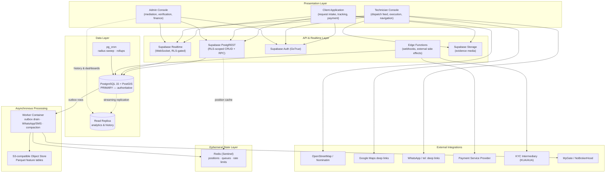

# System Architecture — SewaSync

**Document ID**: SWS-ARCH-001
**Version**: 1.0
**Status**: Baseline for review
**Scope**: System architecture, deployment topology, technology stack, infrastructure and evolution roadmap.

> This document describes *how the system is built and deployed*. Data structures are specified in `DATABASE.md`; behavioural flows in `WORKFLOWS.md`; business rules in `RULES_AND_LOGIC.md`.

---

## 1. Purpose and Architectural Principles

SewaSync is an emergency-capable dispatch platform. Its architecture is shaped by four properties that dominate every other consideration:

1. **Correctness under concurrency outranks throughput.** Two technicians must never be assigned to one emergency; one technician must never be committed to two overlapping jobs. These invariants are enforced by the database engine, not by application logic.
2. **The transactional path is latency-sacred.** No analytics capture, no external API call, and no aggregation query may sit inside a request-serving transaction.
3. **Authorisation belongs in the database.** Three separate front-end surfaces share one backend. Enforcing access control in any of them would triple the attack surface and guarantee divergence.
4. **State is server-authoritative.** The prototype's client-held state is replaced entirely; no lifecycle progression may depend on a browser tab remaining open.

---

## 2. Current State (As-Built)

The repository presently contains a prototype, not a distributed system. An accurate description matters because several documents in this suite would otherwise read as if describing something that exists.

| Aspect | Present reality |
|---|---|
| Application | One Vite + React 19 SPA rooted at `src/` |
| "Two apps" | `apps/clients` and `apps/technician` are approximately ten-line entry wrappers that mount `src/App.tsx` and `src/screens/TechnicianPortal.tsx` respectively |
| State management | React context (`src/context/DispatchContext.tsx`) holding a single in-memory job |
| Cross-surface sync | `BroadcastChannel`, `localStorage` mirroring, and a 1-second HTTP poll against a development-only bridge at `localhost:3000/__sos_dispatch` |
| Data | Static mock arrays in `src/data/mockData.ts` |
| Media | Images resized client-side to base64 data URLs held in memory and `localStorage` |
| Backend | None. No Supabase client, no migrations, no authentication |
| Geocoding | Direct browser calls to public Nominatim; routing via the public OSRM demo server |

Two consequences follow. First, every "realtime" behaviour in the prototype is a same-browser illusion that cannot survive two devices. Second, there is no persistence, so no historical data exists — which is the governing constraint on the analytics and ML roadmap in §9 and §12.

---

## 3. Target Architecture

### 3.1 Layered view



### 3.2 Why this shape

- **PostgREST rather than a bespoke API tier.** With authorisation in RLS, a hand-written CRUD service would add a network hop and a second place for policy to drift. The exception is state mutation, which is deliberately *not* exposed as table writes — see §5.
- **Realtime rather than polling.** The prototype's 1-second poll against a dev bridge is replaced by logical-replication-backed subscriptions. Crucially, Realtime delivery respects RLS, so a technician's subscription to pending requests cannot deliver rows the corresponding `SELECT` policy would refuse.
- **Redis as accelerant, never as truth.** Every value in Redis is reconstructible from PostgreSQL. Cache loss degrades latency, never correctness.
- **A read replica specifically to protect dispatch.** Administrative dashboards and booking history are the heavy, unbounded queries. Isolating them prevents an operations analyst's query from slowing an emergency dispatch.

---

## 4. Technology Stack

| Layer | Technology | Rationale |
|---|---|---|
| Frontend framework | React 19; Vite (current), Next.js App Router (target) | Existing screen inventory is React; Next.js adds server-side session handling and route protection |
| Styling | Tailwind CSS v4 via `@tailwindcss/vite` | Already established in the codebase |
| Mapping (client) | Leaflet / MapLibre + OpenStreetMap tiles | No licensing cost; already integrated |
| Navigation (technician) | Google Maps deep link handoff | Turn-by-turn quality without hosting routing infrastructure |
| Database | PostgreSQL 15+ | Exclusion constraints, partial indexes, declarative partitioning, generated columns — all load-bearing here |
| Spatial | PostGIS (`geography(Point,4326)`) | Correct geodesic distance; `ST_DWithin` with GiST indexing |
| Required extensions | `postgis`, `btree_gist`, `pgcrypto`, `pg_cron`, `pg_stat_statements` | See `DATABASE.md` §2 |
| Backend platform | Supabase (Auth, PostgREST, Realtime, Storage, Edge Functions) | Integrated RLS-aware stack; local CLI stack gives CI parity |
| Cache / queue | Redis 7, Sentinel topology, AOF persistence | See §8 |
| Object storage (analytics) | S3-compatible (Cloudflare R2 or Backblaze B2) | Range-GET support is mandatory for columnar scanning; see §9 |
| Columnar format | Parquet (zstd) | Predicate pushdown and partition pruning |
| Containerisation | Docker | Worker and Redis; Supabase CLI supplies the rest of the local stack |
| CI/CD | GitHub Actions | See §11 |
| DB testing | pgTAP | Constraint and policy assertions belong at the database layer |

---

## 5. Application Topology and Mutation Model

Three surfaces, one backend, and a deliberate asymmetry in how each writes:

| Surface | Reads | Writes |
|---|---|---|
| Client app | RLS-scoped tables; own requests, assigned technician profile, catalogue | Direct inserts (requests, attachments, reviews, messages); limited column updates on own pending request |
| Technician console | Own records; pending requests matching category and within current radius | Position upserts; attachments; cost additions; **all lifecycle transitions via RPC only** |
| Admin console | All records (staff-role predicate) | **All mutations via RPC only**, each writing an audit record |

**The mutation rule**: `requests.status`, `requests.technician_id`, `requests.accepted_at`, `requests.final_price` and all dispute resolutions are unreachable by direct table write. Column-level privileges are revoked and access is available only through `SECURITY DEFINER` functions that take row locks, validate preconditions and write audit events atomically. This is what makes the concurrency guarantees in §6 enforceable rather than aspirational — contract details in `DATABASE.md` §11.

---

## 6. Concurrency Architecture

Two invariants, one mechanism:

- **Real-time exclusivity** — a technician is physically executing at most one emergency job at any instant.
- **Calendar non-overlap** — a technician may hold several accepted future scheduled bookings, provided no two execution windows intersect, and provided none intersects an active emergency.

Both are enforced by a single GiST exclusion constraint over `(technician_id, execution_window)` predicated on non-terminal statuses, requiring `btree_gist` for the equality component. An emergency's window is open-ended until terminal — an overrunning job cannot silently free the calendar. Acceptance additionally takes a row lock (`SELECT … FOR UPDATE`) so that concurrent acceptance attempts on the *same* request serialise and exactly one wins.

Full specification: `DATABASE.md` §9 and §11; behavioural walkthrough: `WORKFLOWS.md` §7.

---

## 7. Realtime Architecture

Four tables are published to the realtime stream. The set is deliberately minimal — every published table costs replication and fan-out overhead:

| Table | Consumer | Purpose |
|---|---|---|
| `requests` | Technician feed; client status view | New pending work; lifecycle progression |
| `technician_locations` | Client tracking map | Live position and ETA |
| `chat_messages` | Both participants | In-app messaging |
| `request_cost_additions` | Client | Mid-job approval prompt |

Client-side channel filters (for example by category) are a bandwidth convenience, **not** a security boundary. The authoritative control is the `SELECT` policy on the underlying table; a subscriber cannot receive a row they could not have queried.

---

## 8. Caching Layer — Redis Topology

**Verdict: Sentinel, not Cluster.** Cluster exists to scale writes and keyspace horizontally past a single node's ceiling. This workload — one city's online technician positions, job queues, rate-limit counters and session cache — is nowhere near that ceiling, while Cluster would cost atomic multi-key operations and single-shard pub/sub fan-out, both of which this design uses. Recommended topology: one primary, two replicas, three Sentinel processes for automated failover; AOF persistence at `appendfsync everysec` (queue data durability matters — a lost dispatch notification is a missed emergency) with periodic RDB snapshots for fast restart.

| Key pattern | Contents | TTL |
|---|---|---|
| `tech:pos:{technician_id}` (or a Redis GEO set) | Hot proximity cache mirroring `technician_locations` | ~90 s, heartbeat-refreshed |
| `session:{user_id}` | Session/auth cache | Matches JWT expiry |
| `dispatch:radius:{request_id}` | Fast-read mirror of current radius tier | Slightly exceeds max expansion window |
| `fair:share:{technician_id}:{category_id}` | Rolling assignment-share EWMA for equity adjustment | Trailing window |
| `queue:whatsapp`, `queue:notifications` | Outbound message streams consumed by the worker | Consumed, not expired |
| `ratelimit:{subject}:{action}` | Sliding-window abuse counters | Window length |

Redis pub/sub is **not** introduced for location fan-out at this stage; Supabase Realtime is expected to suffice, and adding a second fan-out mechanism preemptively would be unjustified complexity.

---

## 9. Telemetry Pipeline and Analytics Cold Tier

### 9.1 Capture: transactional outbox

The constraint is zero latency impact on OLTP. That eliminates:

- **HTTP calls from triggers** (`pg_net` or equivalent) — synchronous network I/O inside the writing transaction is precisely the contention being avoided.
- **Realtime as the extraction mechanism** — it is a broadcast, not a durable queue; a worker restart loses events with no replay.

**Adopted**: a `telemetry_outbox` row written in the same transaction as the business write. A local, indexed insert adds negligible latency and commits or rolls back atomically with the event it records. A worker drains batches into Redis Streams, then compacts to Parquet and uploads out-of-band. The honest cost is table churn: the outbox is append-and-purge and requires tightened autovacuum settings, and is partitioned weekly so drained history is dropped rather than deleted row-by-row.

### 9.2 Cold storage: verdict on consumer cloud storage

**Consumer Google One is rejected as the analytics lake — structurally, not on cost.**

- It is a consumer subscription bound to a personal account; its API quota is per-user, and a service account (the identity an unattended worker would need) receives its own much smaller quota. Shared-drive semantics require Workspace, not One.
- Consumer OAuth refresh tokens are invalidated by password changes, security events and inactivity, with no organisational recovery path. An unattended ingestion worker will eventually fail authentication at a time uncorrelated with any deployment.
- **The disqualifying detail**: Drive offers no S3-compatible interface and no byte-range GET. Polars, DuckDB, PyArrow and PyTorch data loaders all depend on range reads for predicate pushdown and partition pruning. Without them, every "lazy scan" degrades to a full-file download, defeating the purpose of columnar storage entirely.

**Adopted**: an S3-compatible store with zero/near-zero egress (Cloudflare R2 or Backblaze B2) for Parquet feature tables. Consumer cloud storage may serve as a human-browsable archive of raw media, entirely outside the automated pipeline.

### 9.3 Lake layout

```text
raw/media/{category_slug}/{yyyy}/{mm}/{request_id}/{attachment_id}.{ext}
bronze/events/{yyyy}/{mm}/{dd}/{hour}/*.jsonl.zst
silver/features/{feature_group}/{category_slug}/{yyyy}/{mm}/*.parquet
gold/training_sets/{model_name}/{version}/*.parquet
```

Partitioning by category, time and user-bucket serves three purposes simultaneously: query pruning, bounded erasure cost for privacy requests, and reproducible model training snapshots.

### 9.4 Privacy posture

- **Locations are generalised, not hashed.** A hashed address remains a stable join key and is trivially re-identifiable against a small candidate set. Archived location features are truncated to an H3 cell; raw coordinates never leave the transactional tier.
- **Identity fields are salted-hashed** where linkage without content is required (phone, email).
- **Free text is excluded from the cold tier** until an audited redaction pipeline exists; a regex/NER scrub cannot be trusted to catch every embedded identifier, and a false negative here is a breach rather than a data-quality issue.

---

## 10. Containerisation Strategy

Local development runs on the Supabase CLI stack (`supabase start`), which already provides PostgreSQL+PostGIS, GoTrue, Realtime, Storage and Studio as a matched set. Introducing a second, hand-rolled PostgreSQL container alongside it would be redundant and a drift risk. Docker supplies what that stack does not:

| Container | Role | Local | Staging/Production |
|---|---|---|---|
| `redis` | Cache, queues, rate limits | Single node, AOF | Sentinel: 1 primary, 2 replicas, 3 sentinels |
| `worker` | Outbox drain, WhatsApp/SMS dispatch, Parquet compaction | Single instance | Horizontally scalable; competing consumers on Redis Streams |
| `web-client` / `web-technician` | Front-end dev servers | Vite dev server | Static/SSR deployment target |
| *(Supabase stack)* | DB, auth, realtime, storage | Supabase CLI | Supabase hosted project |

Staging parity is achieved by deploying the same component set against a hosted Supabase project and managed Redis — not by re-implementing Supabase internals in containers.

---

## 11. CI/CD Pipeline

| Stage | Action | Gate |
|---|---|---|
| 1 | Lint and type-check front-end surfaces | Blocking |
| 2 | Boot ephemeral Supabase stack in the runner | Blocking |
| 3 | Apply migrations in order against the ephemeral database | Blocking — validates ordering and idempotency |
| 4 | Schema diff against checked-in baseline | Blocking — detects drift between migration history and intent |
| 5 | pgTAP suite: constraints, RLS policies, concurrency assertions | Blocking |
| 6 | Integration tests: concurrent `accept_request`, sweep-versus-acceptance race, settlement refusal path | Blocking |
| 7 | Rollback drill via snapshot restore | Blocking on `main` |
| 8 | Auto-deploy migrations to staging | Automatic |
| 9 | Production migration application | Manual approval (protected environment) |
| 10 | Post-deploy smoke test against seeded fixtures | Blocking; failure triggers alert |

**Note on rollback**: Supabase migrations are forward-only by convention. "Dry-run rollback" is therefore implemented as a snapshot-restore drill — restore the pre-migration snapshot and confirm the previous application version still functions — not as literal down-migrations.

---

## 12. Scalability and Evolution Roadmap

| Phase | Trigger | Scope |
|---|---|---|
| **P0 — Foundation** | Now | Schema, RLS, RPCs, deterministic dispatch, telemetry capture running from day one |
| **P1 — Operations** | First live jobs | Admin console, dispute subsystem, verification pipeline, fraud signals |
| **P2 — Scale-out** | Sustained load on primary | Read replica for analytics; Redis GEO hot path; partition maturation on ping and outbox tables |
| **P3 — Platform migration** | Product decision | Next.js App Router with middleware session guards; proxied, cached geocoding endpoint |
| **P4 — Learned triage** | All four thresholds in `RULES_AND_LOGIC.md` §8.4 satisfied *jointly* | Difficulty classifier, capability model, bandit exploration layered over — not replacing — the deterministic engine |

The deterministic dispatcher is not a stopgap. It is the production matching engine, and it remains the baseline arm against which any future learned policy is measured.

---

## 13. Observability

| Concern | Mechanism |
|---|---|
| Query performance | `pg_stat_statements`; periodic `EXPLAIN (ANALYZE, BUFFERS)` review of the dispatch query specifically |
| Table health | Autovacuum tuning on high-churn tables (`technician_location_pings`, `telemetry_outbox`, `technician_locations`); dead-tuple monitoring |
| Dispatch funnel | Pending-to-accepted latency per radius tier; unfulfilled rate by category and area |
| Equity | Platform-wide Gini coefficient over assignment volume, computed nightly as a monitoring metric (never as an in-loop scoring term) |
| Pipeline health | Outbox depth, drain lag, drop rate, missing-feature rate — these are also the preconditions for P4 |
| Fraud signals | Flag volume and confirmation rate per detector, to track false-positive burden on reviewers |

---

## 14. Architecture Decision Record Summary

| ID | Decision | Rationale | Supersedes |
|---|---|---|---|
| ADR-001 | Store spatial data as `geography(Point,4326)` only; project lat/lng at read time | Storing both is a duplicated fact and a normalisation defect | Prototype's paired float columns |
| ADR-002 | Enforce concurrency with a GiST exclusion constraint over `(technician_id, execution_window)` | A status-only partial unique index cannot see scheduling overlap; the exclusion constraint subsumes both invariants | Earlier partial unique index proposal |
| ADR-003 | Capture telemetry via transactional outbox | Trigger-borne HTTP calls put network I/O in the writing transaction; Realtime has no durability or replay | — |
| ADR-004 | Use S3-compatible storage for the analytics lake | Range-GET is mandatory for columnar scanning; consumer Drive offers none | Consumer Google One proposal |
| ADR-005 | Ship deterministic dispatch; defer learned triage | No labelled history exists; an uncalibrated model underperforms the heuristic | — |
| ADR-006 | Redis Sentinel, not Cluster | Workload is far below sharding thresholds; Cluster costs multi-key atomicity and pub/sub simplicity | — |
| ADR-007 | Snapshot contact details, address, pricing and commission onto transactional rows | Historical accuracy under later edits; also confines technician PII exposure to `requests` | — |
| ADR-008 | Represent staff in a separate registry, not as a third `users.role` value | Staff are neither clients nor technicians; a third enum value would require every existing predicate to exclude it | — |
| ADR-009 | Add an `unfulfilled` terminal state | Radius exhaustion is neither a cancellation nor a decline; conflating them misattributes agency | Eight-state model |
| ADR-010 | Model technician decline of a broadcast request as a private dismissal | One technician's pass must not remove a pending request from every other eligible technician's feed | Prototype's global `declined` mutation |
| ADR-011 | Split `technician_locations` (current position) from `technician_location_pings` (trajectory history) | A unique-per-technician row cannot hold the time series that mobility metrics and ghosting detection require | Single-table location model |
| ADR-012 | Persist a KYC verification token, never an Aadhaar number | Statutory restriction on identifier storage by private entities | — |
