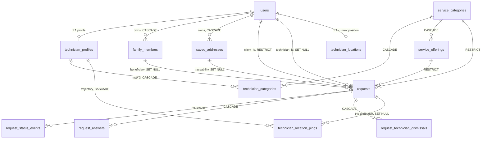
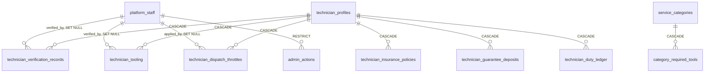
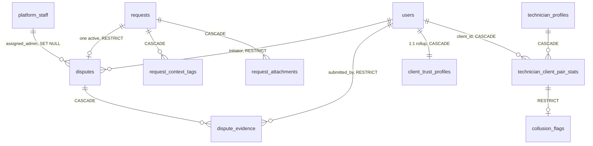
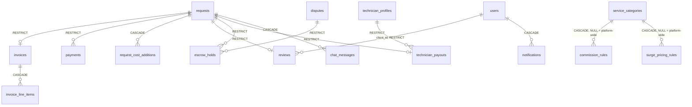

# Database Design Specification — SewaSync

**Document ID**: SWS-DB-001
**Version**: 1.0
**Status**: Baseline for review
**Target platform**: PostgreSQL 15+ with PostGIS, hosted on Supabase

> Specification only. No DDL, no migration scripts, no function bodies. Behavioural semantics are in `WORKFLOWS.md`; business thresholds in `RULES_AND_LOGIC.md`.

---

## 1. Conventions

| Convention | Rule |
|---|---|
| Primary keys | `UUID` with `gen_random_uuid()`, except high-volume append tables which use identity `BIGINT` |
| Timestamps | `TIMESTAMPTZ` exclusively; `created_at` defaults to `now()`; `updated_at` maintained by trigger |
| Naming | `snake_case`; tables plural; junction tables named for the relationship |
| Money | `NUMERIC(10,2)` for transactional amounts, `NUMERIC(12,2)` for coverage sums; never floating point |
| Rates | `NUMERIC(5,2)` percentage, or `NUMERIC(5,4)` for stored ratios |
| Spatial | `GEOGRAPHY(Point, 4326)` only — see §6 |
| Telephone | Canonical E.164, no punctuation; display formatting is a presentation concern |
| Deletion | Business records are closed by status, never hard-deleted. Financial and dispute references use `ON DELETE RESTRICT` |
| Enumerations | Native PostgreSQL `ENUM` types for closed, stable value sets; `TEXT` with a lookup table where values are operationally extensible |

**Deliberate denormalisations** (each justified, never accidental): snapshotted contact details and address on `requests`; snapshotted pricing, duration and surge multiplier on `requests`; materialised rollups (`technician_profiles.rating`, `technician_duty_ledger`, `client_trust_profiles`, `technician_client_pair_stats`). Every one is either a historical-accuracy requirement or a read-performance materialisation of a derivable fact, and is labelled as such in §5.

---

## 2. Required Extensions

| Extension | Purpose | Criticality |
|---|---|---|
| `postgis` | Geography type, `ST_DWithin`, GiST spatial indexing | Mandatory |
| `btree_gist` | Equality operator class inside the GiST exclusion constraint | Mandatory — concurrency invariant depends on it |
| `pgcrypto` | `gen_random_uuid()` | Mandatory |
| `pg_cron` | Radius expansion sweep, nightly rollups, retention jobs | Mandatory (Edge Function scheduling is the fallback) |
| `pg_stat_statements` | Query observability | Strongly recommended |

---

## 3. Enumerated Type Catalogue

| Type | Values | Used by |
|---|---|---|
| `user_role` | `client`, `technician` | `users.role` — staff are **not** represented here |
| `staff_role` | `support_moderator`, `super_admin` | `platform_staff.staff_role` |
| `request_status` | `pending`, `accepted`, `en_route`, `arrived`, `in_progress`, `completed`, `cancelled`, `declined`, `unfulfilled` | `requests`, `request_status_events` |
| `request_priority` | `low`, `medium`, `high` | `requests.priority` |
| `status_event_reason` | `client_initiated`, `technician_honest`, `technician_ghosted`, `system_timeout`, `admin_override` | `request_status_events.reason` |
| `actor_role` | `client`, `technician`, `system`, `admin` | `request_status_events.actor_role` |
| `attachment_kind` | `image`, `video` | `request_attachments.kind` |
| `attachment_phase` | `pre_work`, `post_work` | `request_attachments.phase` |
| `payment_method` | `upi`, `card`, `netbanking`, `cash` | `payments.method` |
| `payment_status` | `pending`, `processing`, `succeeded`, `failed` | `payments.status` |
| `cost_addition_status` | `pending`, `approved`, `declined` | `request_cost_additions.status` |
| `price_adjustment_reason` | `additional_parts`, `additional_labor_time`, `access_difficulty`, `misdiagnosis_correction`, `customer_requested_scope_change`, `other` | `requests.price_adjustment_reason` |
| `notification_type` | `status_update`, `eta_update`, `arrival`, `approval_request`, `invoice_ready`, `booking_confirmed` | `notifications.type` |
| `chat_sender_role` | `system`, `client`, `technician` | `chat_messages.sender_role` |
| `liability_tier` | `tier_1`, `tier_2`, `tier_3` | `service_categories.liability_tier` |
| `verification_type` | `aadhaar_ekyc`, `pan`, `police_verification`, `skill_assessment` | `technician_verification_records` |
| `verification_status` | `pending`, `verified`, `rejected`, `expired` | `technician_verification_records` |
| `deposit_status` | `active`, `forfeited`, `refunded` | `technician_guarantee_deposits` |
| `throttle_type` | `fatigue`, `admin_manual`, `risk_based`, `ghosting_lockout` | `technician_dispatch_throttles` |
| `dispute_reason` | `price_dispute`, `quality_issue`, `no_show`, `safety_concern`, `harassment`, `property_damage`, `other` | `disputes.reason_category` |
| `dispute_status` | `open`, `under_review`, `awaiting_response`, `resolved_client_favor`, `resolved_technician_favor`, `resolved_split`, `dismissed` | `disputes.status` |
| `liability_party` | `client`, `technician`, `platform`, `split` | `disputes.liability_party` |
| `evidence_type` | `photo`, `video`, `chat_excerpt`, `status_event_ref` | `dispute_evidence.evidence_type` |
| `context_tag_type` | `society_entry_delay`, `no_lift_high_floor`, `vernacular_mismatch`, `other` | `request_context_tags.tag_type` |
| `context_tag_source` | `mygate_api`, `nobrokerhood_api`, `security_log`, `technician_reported`, `admin_adjusted` | `request_context_tags.source` |
| `network_type` | `wifi`, `cellular_4g`, `cellular_5g`, `unknown` | `technician_location_pings.network_type` |
| `client_risk_band` | `trusted`, `review_needed`, `high_risk` | `client_trust_profiles.risk_band` |
| `escrow_status` | `held`, `released`, `forfeited` | `escrow_holds.status` |
| `payout_status` | `pending`, `disbursed`, `held` | `technician_payouts.status` |
| `admin_action_type` | `force_advance_status`, `force_payout`, `issue_refund`, `reassign_technician`, `suspend_technician`, `override_throttle`, `other` | `admin_actions.action_type` |

---

## 4. Entity Relationship Diagrams

Four domain diagrams rather than one monolith — a single 40-entity diagram is unreadable and obscures the domain boundaries that actually matter.

### 4.1 Core Identity and Dispatch

### 4.2 Governance, Verification and Duty

### 4.3 Mediation, Trust and Fraud

### 4.4 Financial Ledger

**Cascade philosophy**: `CASCADE` where the child is meaningless without the parent (attachments, line items, evidence). `SET NULL` where the reference is contextual and the child survives independently (a trajectory ping outlives its trip attribution). `RESTRICT` on every financial and dispute reference — a liability finding must never lose its referent.

---

## 5. Data Dictionary

### 5.1 Identity and Profiles

#### `users`

| Column | Type | Null | Default | Constraint |
|---|---|---|---|---|
| `id` | `UUID` | NOT NULL | — | PK; FK → `auth.users(id)` ON DELETE CASCADE |
| `role` | `user_role` | NOT NULL | `'client'` | — |
| `name` | `TEXT` | NOT NULL | — | — |
| `phone` | `TEXT` | NULL | — | UNIQUE; CHECK E.164 format |
| `email` | `TEXT` | NULL | — | UNIQUE |
| `preferred_language` | `TEXT` | NULL | — | BCP-47 tag; supports vernacular matching |
| `default_location` | `GEOGRAPHY(Point,4326)` | NULL | — | — |
| `default_street_address` | `TEXT` | NULL | — | — |
| `default_unit_floor` | `TEXT` | NULL | — | — |
| `created_at` / `updated_at` | `TIMESTAMPTZ` | NOT NULL | `now()` | — |

*Rationale*: shared identity for the two participant classes. Populated by a trigger on `auth.users` insertion. Staff are deliberately excluded — see `platform_staff`.

#### `technician_profiles`

| Column | Type | Null | Default | Constraint |
|---|---|---|---|---|
| `id` | `UUID` | NOT NULL | — | PK; FK → `users(id)` ON DELETE CASCADE |
| `vehicle_type` | `TEXT` | NULL | — | — |
| `vehicle_registration` | `TEXT` | NULL | — | — |
| `experience_years` | `NUMERIC(4,1)` | NULL | — | CHECK ≥ 0 |
| `identity_verified` | `BOOLEAN` | NOT NULL | `false` | Derived summary of `technician_verification_records` |
| `skill_verified` | `BOOLEAN` | NOT NULL | `false` | — |
| `background_checked` | `BOOLEAN` | NOT NULL | `false` | — |
| `rating` | `NUMERIC(2,1)` | NOT NULL | `0` | CHECK 0–5; **Bayesian-adjusted**, system-maintained |
| `review_count` | `INTEGER` | NOT NULL | `0` | `n` in the reputation formula; system-maintained |
| `total_jobs` | `INTEGER` | NOT NULL | `0` | System-maintained |
| `is_online` | `BOOLEAN` | NOT NULL | `false` | Technician-controlled duty toggle |
| `photo_url` | `TEXT` | NULL | — | — |
| `created_at` / `updated_at` | `TIMESTAMPTZ` | NOT NULL | `now()` | — |

*Rationale*: capability and reputation metadata. **No stored "busy" flag** — availability is derived from the existence of a non-terminal request with an active execution window, avoiding a second source of truth that could drift under concurrency. `rating` and `review_count` have `UPDATE` revoked from participants at column level.

#### `platform_staff`

| Column | Type | Null | Default | Constraint |
|---|---|---|---|---|
| `id` | `UUID` | NOT NULL | — | PK; FK → `auth.users(id)` ON DELETE CASCADE |
| `staff_role` | `staff_role` | NOT NULL | — | — |
| `display_name` | `TEXT` | NOT NULL | — | — |
| `created_at` | `TIMESTAMPTZ` | NOT NULL | `now()` | — |

*Rationale*: structurally separate from `users`. Staff are neither clients nor technicians; a third `user_role` value would force every existing participant predicate to exclude it, and would leave client-specific columns nullable on staff rows.

#### `technician_categories`

| Column | Type | Null | Default | Constraint |
|---|---|---|---|---|
| `technician_id` | `UUID` | NOT NULL | — | PK (composite); FK → `technician_profiles(id)` ON DELETE CASCADE |
| `category_id` | `UUID` | NOT NULL | — | PK (composite); FK → `service_categories(id)` ON DELETE CASCADE |
| `registered_at` | `TIMESTAMPTZ` | NOT NULL | `now()` | — |

*Rationale*: replaces an earlier `text[]` specialty array. A multi-valued attribute that must be joined, filtered and counted violates 1NF and cannot carry a row-count cap. **Maximum three rows per technician**, enforced by the locking trigger in §10.

### 5.2 Service Catalogue

#### `service_categories`

| Column | Type | Null | Default | Constraint |
|---|---|---|---|---|
| `id` | `UUID` | NOT NULL | `gen_random_uuid()` | PK |
| `slug` | `TEXT` | NOT NULL | — | UNIQUE |
| `name` | `TEXT` | NOT NULL | — | — |
| `icon` | `TEXT` | NOT NULL | — | Emoji or icon key |
| `description` | `TEXT` | NULL | — | — |
| `supports_sos` | `BOOLEAN` | NOT NULL | `true` | — |
| `supports_scheduled` | `BOOLEAN` | NOT NULL | `true` | — |
| `sos_base_price` | `NUMERIC(10,2)` | NULL | — | CHECK ≥ 0; NOT NULL when `supports_sos` |
| `sos_emergency_fee` | `NUMERIC(10,2)` | NULL | — | CHECK ≥ 0; NOT NULL when `supports_sos` |
| `default_duration_minutes` | `INTEGER` | NULL | — | CHECK > 0 |
| `liability_tier` | `liability_tier` | NOT NULL | `'tier_1'` | Gates insurance prerequisite |
| `created_at` / `updated_at` | `TIMESTAMPTZ` | NOT NULL | `now()` | — |

*Rationale*: one category identity serving both dispatch modes. The prototype's split catalogues (emergency vs scheduled, with colliding slugs and divergent prices) are unified here; scheduled pricing lives per-offering, and the "from ₹X" display value is `MIN(price)` over offerings, not a stored duplicate.

*Styling note*: the prototype's Tailwind `color` token is deliberately **not** modelled — it is presentation, derivable from `slug` in the front end.

#### `service_offerings`

| Column | Type | Null | Default | Constraint |
|---|---|---|---|---|
| `id` | `UUID` | NOT NULL | `gen_random_uuid()` | PK |
| `category_id` | `UUID` | NOT NULL | — | FK → `service_categories(id)` ON DELETE CASCADE |
| `name` | `TEXT` | NOT NULL | — | — |
| `description` | `TEXT` | NULL | — | — |
| `price` | `NUMERIC(10,2)` | NOT NULL | — | CHECK ≥ 0 |
| `duration_min_minutes` | `INTEGER` | NULL | — | CHECK > 0 |
| `duration_max_minutes` | `INTEGER` | NULL | — | CHECK ≥ `duration_min_minutes` |
| `sort_order` | `INTEGER` | NOT NULL | `0` | — |
| `created_at` / `updated_at` | `TIMESTAMPTZ` | NOT NULL | `now()` | — |

*Rationale*: durations are stored as an integer range rather than the prototype's display string ("1–2 hrs"), so they can be arithmetically used for execution-window computation.

#### `category_required_tools`

| Column | Type | Null | Default | Constraint |
|---|---|---|---|---|
| `category_id` | `UUID` | NOT NULL | — | PK (composite); FK → `service_categories(id)` ON DELETE CASCADE |
| `tool_type` | `TEXT` | NOT NULL | — | PK (composite) |
| `mandatory` | `BOOLEAN` | NOT NULL | `true` | Distinguishes hard-blocking from advisory |
| `min_liability_tier` | `liability_tier` | NOT NULL | `'tier_1'` | Tier at which this tool becomes required |

### 5.3 Client Addressing and Delegation

#### `saved_addresses`

| Column | Type | Null | Default | Constraint |
|---|---|---|---|---|
| `id` | `UUID` | NOT NULL | `gen_random_uuid()` | PK |
| `user_id` | `UUID` | NOT NULL | — | FK → `users(id)` ON DELETE CASCADE |
| `label` | `TEXT` | NOT NULL | — | — |
| `icon` | `TEXT` | NULL | — | User-chosen marker |
| `address_line` | `TEXT` | NOT NULL | — | — |
| `area` | `TEXT` | NOT NULL | — | — |
| `location` | `GEOGRAPHY(Point,4326)` | NULL | — | — |
| `is_default` | `BOOLEAN` | NOT NULL | `false` | Partial UNIQUE on `(user_id) WHERE is_default` |
| `created_at` / `updated_at` | `TIMESTAMPTZ` | NOT NULL | `now()` | — |

#### `family_members`

| Column | Type | Null | Default | Constraint |
|---|---|---|---|---|
| `id` | `UUID` | NOT NULL | `gen_random_uuid()` | PK |
| `owner_id` | `UUID` | NOT NULL | — | FK → `users(id)` ON DELETE CASCADE |
| `name` | `TEXT` | NOT NULL | — | — |
| `relation` | `TEXT` | NOT NULL | — | Open vocabulary — not an enum |
| `phone` | `TEXT` | NULL | — | E.164 |
| `emoji` | `TEXT` | NULL | — | User-chosen avatar |
| `address_line` | `TEXT` | NOT NULL | — | — |
| `area` | `TEXT` | NOT NULL | — | — |
| `location` | `GEOGRAPHY(Point,4326)` | NULL | — | — |
| `created_at` / `updated_at` | `TIMESTAMPTZ` | NOT NULL | `now()` | — |

*Rationale*: a beneficiary, never an authenticable identity. Delegation is one-directional: the owner manages the record; the beneficiary has no account, no visibility and no write path.

### 5.4 The Request Spine

#### `requests`

| Column | Type | Null | Default | Constraint |
|---|---|---|---|---|
| `id` | `UUID` | NOT NULL | `gen_random_uuid()` | PK |
| `client_id` | `UUID` | NOT NULL | — | FK → `users(id)` ON DELETE RESTRICT |
| `family_member_id` | `UUID` | NULL | — | FK → `family_members(id)` ON DELETE SET NULL |
| `saved_address_id` | `UUID` | NULL | — | FK → `saved_addresses(id)` ON DELETE SET NULL |
| `technician_id` | `UUID` | NULL | — | FK → `users(id)` ON DELETE SET NULL; RPC-only write |
| `category_id` | `UUID` | NOT NULL | — | FK → `service_categories(id)` ON DELETE RESTRICT |
| `offering_id` | `UUID` | NULL | — | FK → `service_offerings(id)` ON DELETE RESTRICT |
| `status` | `request_status` | NOT NULL | `'pending'` | RPC-only write |
| `priority` | `request_priority` | NULL | — | CHECK: NOT NULL when `scheduled_at IS NULL` |
| `service_location` | `GEOGRAPHY(Point,4326)` | NOT NULL | — | Sole spatial truth |
| `address_line` | `TEXT` | NOT NULL | — | Immutable snapshot |
| `area` | `TEXT` | NOT NULL | — | Immutable snapshot |
| `contact_name` | `TEXT` | NOT NULL | — | Snapshot (trigger-populated) |
| `contact_phone` | `TEXT` | NOT NULL | — | Snapshot, E.164 |
| `technician_location_at_dispatch` | `GEOGRAPHY(Point,4326)` | NULL | — | Captured inside `accept_request()` |
| `description` | `TEXT` | NULL | — | — |
| `symptoms` | `TEXT[]` | NOT NULL | `'{}'` | Display-only; never joined or capped |
| `estimated_total` | `NUMERIC(10,2)` | NOT NULL | — | CHECK ≥ 0 |
| `surge_multiplier_applied` | `NUMERIC(4,2)` | NOT NULL | `1.00` | CHECK ≥ 1.00; snapshot |
| `final_price` | `NUMERIC(10,2)` | NULL | — | CHECK ≥ 0; written only by `settle_job_payment()` |
| `price_adjustment_reason` | `price_adjustment_reason` | NULL | — | CHECK: NOT NULL when `final_price > estimated_total` |
| `price_adjustment_notes` | `TEXT` | NULL | — | CHECK: NOT NULL when reason = `'other'` or variance exceeds threshold |
| `estimated_duration_minutes` | `INTEGER` | NULL | — | Snapshot from offering or category default |
| `scheduled_at` | `TIMESTAMPTZ` | NULL | — | NULL ⇒ emergency |
| `accepted_at` | `TIMESTAMPTZ` | NULL | — | Set by `accept_request()`; feeds `execution_window` |
| `completed_at` | `TIMESTAMPTZ` | NULL | — | — |
| `search_radius_km` | `INTEGER` | NOT NULL | `10` | CHECK BETWEEN 10 AND 30 |
| `radius_expanded_at` | `TIMESTAMPTZ` | NULL | — | Sweep cursor |
| `superseded_from_request_id` | `UUID` | NULL | — | FK → `requests(id)` ON DELETE SET NULL; re-dispatch lineage |
| `execution_window` | `TSTZRANGE` GENERATED STORED | derived | — | See §9.1 |
| `created_at` / `updated_at` | `TIMESTAMPTZ` | NOT NULL | `now()` | — |

**Table-level CHECK constraints**

| Constraint | Expression (descriptive) |
|---|---|
| `emergency_requires_priority` | `scheduled_at IS NOT NULL OR priority IS NOT NULL` |
| `offering_only_for_scheduled` | `offering_id IS NULL OR scheduled_at IS NOT NULL` |
| `beneficiary_xor_saved_address` | NOT (`family_member_id IS NOT NULL` AND `saved_address_id IS NOT NULL`) |
| `variance_requires_reason` | `final_price IS NULL OR final_price <= estimated_total OR price_adjustment_reason IS NOT NULL` |

*Rationale*: the schema's spine. Contact and address are snapshots for two reasons — historical accuracy when source records change, and confinement of technician-visible PII to a single table, which keeps the pre-acceptance visibility policy from needing to reach into `users` or `family_members`.

#### `request_status_events`

| Column | Type | Null | Default | Constraint |
|---|---|---|---|---|
| `id` | `UUID` | NOT NULL | `gen_random_uuid()` | PK |
| `request_id` | `UUID` | NOT NULL | — | FK → `requests(id)` ON DELETE CASCADE |
| `status` | `request_status` | NOT NULL | — | — |
| `actor_id` | `UUID` | NULL | — | Resolved against `users` or `platform_staff` per `actor_role` |
| `actor_role` | `actor_role` | NOT NULL | — | Disambiguates `actor_id` |
| `reason` | `status_event_reason` | NULL | — | Populated on cancellation/decline |
| `occurred_at` | `TIMESTAMPTZ` | NOT NULL | `now()` | — |

*Rationale*: append-only audit. Trigger-written; no participant `INSERT` policy exists. Backs the service timeline, elapsed-duration computation and the invoice time range.

#### `request_attachments`

| Column | Type | Null | Default | Constraint |
|---|---|---|---|---|
| `id` | `UUID` | NOT NULL | `gen_random_uuid()` | PK |
| `request_id` | `UUID` | NOT NULL | — | FK → `requests(id)` ON DELETE CASCADE |
| `kind` | `attachment_kind` | NOT NULL | — | — |
| `phase` | `attachment_phase` | NOT NULL | — | Required for pre/post pairing |
| `storage_path` | `TEXT` | NOT NULL | — | Convention: `{request_id}/{uuid}.{ext}` |
| `file_name` | `TEXT` | NULL | — | — |
| `exif_lat` / `exif_lng` | `DOUBLE PRECISION` | NULL | — | Extracted at upload; raw EXIF, not a location of record |
| `captured_at` | `TIMESTAMPTZ` | NULL | — | From EXIF where present |
| `phash` | `BIT(64)` | NULL | — | Perceptual hash for reuse/mismatch detection |
| `uploaded_by` | `UUID` | NOT NULL | — | FK → `users(id)` ON DELETE RESTRICT |
| `created_at` | `TIMESTAMPTZ` | NOT NULL | `now()` | — |

#### `request_answers`, `request_technician_dismissals`

| Table | Columns | Notes |
|---|---|---|
| `request_answers` | `id` PK, `request_id` FK CASCADE, `question TEXT NOT NULL`, `answer TEXT NOT NULL`, `created_at` | Diagnostic questionnaire. **Schema-ready; front-end currently discards answers in local state** — wiring required. |
| `request_technician_dismissals` | Composite PK `(request_id, technician_id)`, both FK CASCADE, `dismissed_at` | A technician's private "not for me". Never alters global request state — this is what prevents one technician's pass from removing a pending request from every other eligible technician's feed. |

#### `request_context_tags`

| Column | Type | Null | Default | Constraint |
|---|---|---|---|---|
| `id` | `UUID` | NOT NULL | `gen_random_uuid()` | PK |
| `request_id` | `UUID` | NOT NULL | — | FK → `requests(id)` ON DELETE CASCADE |
| `tag_type` | `context_tag_type` | NOT NULL | — | — |
| `delay_minutes` | `INTEGER` | NULL | — | CHECK ≥ 0; NULL for `vernacular_mismatch` |
| `source` | `context_tag_source` | NOT NULL | — | — |
| `recorded_at` | `TIMESTAMPTZ` | NOT NULL | `now()` | — |

*Rationale*: isolates structural delay (gated-society clearance, absent lift) from technician performance. Duration metrics consume `actual_duration − Σ delay_minutes`, never raw duration.

### 5.5 Location and Telemetry

#### `technician_locations` — current position cache

| Column | Type | Null | Default | Constraint |
|---|---|---|---|---|
| `id` | `UUID` | NOT NULL | `gen_random_uuid()` | PK |
| `technician_id` | `UUID` | NOT NULL | — | **UNIQUE**; FK → `users(id)` ON DELETE CASCADE |
| `request_id` | `UUID` | NULL | — | FK → `requests(id)` ON DELETE SET NULL |
| `location` | `GEOGRAPHY(Point,4326)` | NOT NULL | — | GiST indexed — dispatch hot path |
| `heading` / `speed` | `DOUBLE PRECISION` | NULL | — | — |
| `updated_at` | `TIMESTAMPTZ` | NOT NULL | `now()` | — |

*Rationale and scope limit*: exactly one row per technician, upserted. This table serves proximity search and live tracking **only**. No historical or mobility query reads it.

#### `technician_location_pings` — trajectory history

| Column | Type | Null | Default | Constraint |
|---|---|---|---|---|
| `id` | `BIGINT` IDENTITY | NOT NULL | — | PK (composite with `recorded_at`, per partitioning) |
| `technician_id` | `UUID` | NOT NULL | — | FK → `technician_profiles(id)` ON DELETE CASCADE |
| `request_id` | `UUID` | NULL | — | FK → `requests(id)` ON DELETE SET NULL |
| `location` | `GEOGRAPHY(Point,4326)` | NOT NULL | — | GiST indexed per partition |
| `heading` / `speed` | `DOUBLE PRECISION` | NULL | — | — |
| `accuracy_meters` | `DOUBLE PRECISION` | NULL | — | Device-reported |
| `network_type` | `network_type` | NULL | — | Confound classification input |
| `battery_saver_suspected` | `BOOLEAN` | NOT NULL | `false` | Heuristic flag |
| `recorded_at` | `TIMESTAMPTZ` | NOT NULL | `now()` | **Partition key** |

*Rationale — correction to earlier design phases*: `technician_locations` holds one row per technician and structurally cannot store a time series. Every mobility metric (average speed, trajectory density), the stationary-GPS ghosting detector, and telemetry-confound compensation require trajectory history. This table supplies it. It is the highest-write-volume table in the schema; see §8.

#### `telemetry_outbox`

| Column | Type | Null | Default | Constraint |
|---|---|---|---|---|
| `id` | `BIGINT` IDENTITY | NOT NULL | — | PK (composite with `created_at`) |
| `event_type` | `TEXT` | NOT NULL | — | — |
| `payload` | `JSONB` | NOT NULL | — | — |
| `created_at` | `TIMESTAMPTZ` | NOT NULL | `now()` | **Partition key** |
| `drained_at` | `TIMESTAMPTZ` | NULL | — | Set by worker; row purged by partition drop |

*Rationale*: written in the same transaction as the business event it records — a cheap local insert with no network dependency. See `ARCHITECTURE.md` §9.1.

### 5.6 Governance and Compliance

#### `technician_verification_records`

| Column | Type | Null | Default | Constraint |
|---|---|---|---|---|
| `id` | `UUID` | NOT NULL | `gen_random_uuid()` | PK |
| `technician_id` | `UUID` | NOT NULL | — | FK → `technician_profiles(id)` ON DELETE CASCADE |
| `verification_type` | `verification_type` | NOT NULL | — | — |
| `verification_reference_token` | `TEXT` | NOT NULL | — | Opaque token from the licensed intermediary |
| `masked_identifier` | `TEXT` | NULL | — | Last four digits only |
| `status` | `verification_status` | NOT NULL | `'pending'` | — |
| `verifying_authority` | `TEXT` | NULL | — | KUA/AUA reference |
| `verified_by` | `UUID` | NULL | — | FK → `platform_staff(id)` ON DELETE SET NULL |
| `verified_at` / `expires_at` | `TIMESTAMPTZ` | NULL | — | — |

*Rationale — compliance-shaped by design*: Aadhaar numbers are never persisted. Statutory restrictions on identifier storage by private entities mean verification must occur through a licensed KUA/AUA, with the platform retaining proof of verification rather than the identifier verified. The column set is a direct consequence of that constraint.

#### `technician_tooling`

| Column | Type | Null | Default | Constraint |
|---|---|---|---|---|
| `id` | `UUID` | NOT NULL | `gen_random_uuid()` | PK |
| `technician_id` | `UUID` | NOT NULL | — | FK → `technician_profiles(id)` ON DELETE CASCADE |
| `tool_type` | `TEXT` | NOT NULL | — | UNIQUE with `technician_id` |
| `serial_number` | `TEXT` | NULL | — | — |
| `evidence_ref` | `TEXT` | NULL | — | Storage path to attestation photo |
| `verified_at` | `TIMESTAMPTZ` | NULL | — | — |
| `verified_by` | `UUID` | NULL | — | FK → `platform_staff(id)` ON DELETE SET NULL |
| `reattestation_due_at` | `TIMESTAMPTZ` | NULL | — | Drives gate re-engagement |

#### `technician_insurance_policies` / `technician_guarantee_deposits`

| Table | Columns |
|---|---|
| `technician_insurance_policies` | `id` PK; `technician_id` FK CASCADE; `policy_type TEXT NOT NULL`; `coverage_amount NUMERIC(12,2) NOT NULL CHECK > 0`; `provider TEXT NOT NULL`; `policy_number TEXT NOT NULL`; `expiry_date DATE NOT NULL`; `verified_at TIMESTAMPTZ`; `verified_by` FK → `platform_staff` SET NULL |
| `technician_guarantee_deposits` | `id` PK; `technician_id` FK CASCADE; `deposit_amount NUMERIC(10,2) NOT NULL CHECK ≥ 0`; `status deposit_status NOT NULL DEFAULT 'active'`; `held_since TIMESTAMPTZ NOT NULL DEFAULT now()`; `forfeited_reason TEXT` |

*Rationale*: the deposit table is the deliberate alternative pathway to tier-2/3 eligibility for technicians without access to formal insurance products — preserving the platform's meritocratic premise that capability, not credential access, should govern work allocation.

#### `technician_duty_ledger`

| Column | Type | Null | Default | Constraint |
|---|---|---|---|---|
| `technician_id` | `UUID` | NOT NULL | — | PK (composite); FK CASCADE |
| `duty_date` | `DATE` | NOT NULL | — | PK (composite) |
| `active_minutes` | `INTEGER` | NOT NULL | `0` | Derived from execution windows |
| `continuous_streak_minutes_max` | `INTEGER` | NOT NULL | `0` | — |
| `heat_adjusted_cap_minutes` | `INTEGER` | NULL | — | Lowered cap on flagged extreme-heat days |
| `throttled` | `BOOLEAN` | NOT NULL | `false` | — |
| `last_computed_at` | `TIMESTAMPTZ` | NOT NULL | `now()` | — |

*Rationale*: an explicitly labelled materialisation of a derivable fact — the Live Shift Monitor must read one row, not aggregate range history on every poll. Not authoritative if it disagrees with a fresh aggregation.

#### `technician_dispatch_throttles`

| Column | Type | Null | Default | Constraint |
|---|---|---|---|---|
| `id` | `UUID` | NOT NULL | `gen_random_uuid()` | PK |
| `technician_id` | `UUID` | NOT NULL | — | FK → `technician_profiles(id)` ON DELETE CASCADE |
| `throttle_type` | `throttle_type` | NOT NULL | — | — |
| `active_from` | `TIMESTAMPTZ` | NOT NULL | `now()` | — |
| `active_until` | `TIMESTAMPTZ` | NULL | — | NULL ⇒ open-ended |
| `reason` | `TEXT` | NOT NULL | — | — |
| `applied_by` | `UUID` | NULL | — | FK → `platform_staff(id)` SET NULL; NULL ⇒ system-applied |

*Rationale*: the unified eligibility-block mechanism. Fatigue caps, ghosting lockouts, risk-based restrictions and manual suspensions all materialise here, so dispatch performs one uniform "is this technician blocked" check rather than four differently-shaped ones.

### 5.7 Mediation, Trust and Fraud

#### `disputes`

| Column | Type | Null | Default | Constraint |
|---|---|---|---|---|
| `id` | `UUID` | NOT NULL | `gen_random_uuid()` | PK |
| `request_id` | `UUID` | NOT NULL | — | FK → `requests(id)` ON DELETE RESTRICT; partial UNIQUE while active |
| `initiator_id` | `UUID` | NOT NULL | — | FK → `users(id)` ON DELETE RESTRICT |
| `initiator_role` | `user_role` | NOT NULL | — | — |
| `reason_category` | `dispute_reason` | NOT NULL | — | — |
| `description` | `TEXT` | NOT NULL | — | — |
| `status` | `dispute_status` | NOT NULL | `'open'` | — |
| `assigned_admin_id` | `UUID` | NULL | — | FK → `platform_staff(id)` SET NULL |
| `liability_amount` | `NUMERIC(10,2)` | NULL | — | CHECK ≥ 0 |
| `liability_party` | `liability_party` | NULL | — | NOT NULL once terminal |
| `created_at` | `TIMESTAMPTZ` | NOT NULL | `now()` | — |
| `resolved_at` | `TIMESTAMPTZ` | NULL | — | — |

#### `dispute_evidence`

`id` PK; `dispute_id` FK CASCADE; `evidence_type evidence_type NOT NULL`; `evidence_ref TEXT NOT NULL`; `submitted_by` FK → `users` RESTRICT; `submitted_at TIMESTAMPTZ NOT NULL DEFAULT now()`.

#### `client_trust_profiles`

| Column | Type | Null | Default | Constraint |
|---|---|---|---|---|
| `client_id` | `UUID` | NOT NULL | — | PK; FK → `users(id)` ON DELETE CASCADE |
| `cancellation_rate_post_arrival` | `NUMERIC(5,4)` | NOT NULL | `0` | Weighted most heavily |
| `payment_dispute_rate` | `NUMERIC(5,4)` | NOT NULL | `0` | — |
| `harassment_report_count` | `INTEGER` | NOT NULL | `0` | — |
| `risk_band` | `client_risk_band` | NOT NULL | `'trusted'` | Bayesian-shrunk banding |
| `last_computed_at` | `TIMESTAMPTZ` | NOT NULL | `now()` | — |

*Rationale*: the technician capability model applied symmetrically to clients. Trust and safety are bidirectional; a system that scores only technicians is incomplete.

#### `technician_client_pair_stats` / `collusion_flags`

| Table | Columns |
|---|---|
| `technician_client_pair_stats` | Composite PK `(technician_id, client_id)`, both FK CASCADE; `observed_match_count INTEGER NOT NULL DEFAULT 0`; `expected_match_count NUMERIC(8,4) NOT NULL DEFAULT 0`; `deviation_score NUMERIC(8,4) NOT NULL DEFAULT 0`; `flagged BOOLEAN NOT NULL DEFAULT false`; `last_computed_at` |
| `collusion_flags` | `id` PK; `technician_id`, `client_id` FK; `score NUMERIC(8,4)`; `evidence_refs JSONB`; `status TEXT` (`open`/`cleared`/`confirmed`); `reviewed_by` FK → `platform_staff` SET NULL; `created_at`, `reviewed_at` |

#### `admin_actions`

| Column | Type | Null | Default | Constraint |
|---|---|---|---|---|
| `id` | `UUID` | NOT NULL | `gen_random_uuid()` | PK |
| `admin_id` | `UUID` | NOT NULL | — | FK → `platform_staff(id)` ON DELETE RESTRICT |
| `action_type` | `admin_action_type` | NOT NULL | — | — |
| `target_entity_type` | `TEXT` | NOT NULL | — | — |
| `target_entity_id` | `UUID` | NOT NULL | — | — |
| `justification` | `TEXT` | NOT NULL | — | CHECK length > 0 — no empty override |
| `before_snapshot` / `after_snapshot` | `JSONB` | NULL | — | Targeted columns, not full rows |
| `created_at` | `TIMESTAMPTZ` | NOT NULL | `now()` | **Partition key** |

### 5.8 Financial Ledger

| Table | Columns | Notes |
|---|---|---|
| `invoices` | `id` PK; `request_id` FK RESTRICT **UNIQUE**; `invoice_number TEXT UNIQUE NOT NULL`; `subtotal`, `tax`, `total` `NUMERIC(10,2) NOT NULL`; `commission_rate_applied NUMERIC(5,2) NOT NULL`; `issued_at` | Generated on completion; commission rate snapshotted so past invoices stay reproducible |
| `invoice_line_items` | `id` PK; `invoice_id` FK CASCADE; `description TEXT NOT NULL`; `amount NUMERIC(10,2) NOT NULL`; `sort_order INTEGER NOT NULL DEFAULT 0` | One line per base service plus one per approved cost addition |
| `request_cost_additions` | `id` PK; `request_id` FK CASCADE; `reason TEXT NOT NULL`; `tags TEXT[] NOT NULL DEFAULT '{}'`; `amount NUMERIC(10,2) NOT NULL CHECK > 0`; `status cost_addition_status NOT NULL DEFAULT 'pending'`; `created_at`, `resolved_at` | The approval gate for every upward price variance |
| `payments` | `id` PK; `request_id` FK RESTRICT; `method payment_method NOT NULL`; `status payment_status NOT NULL DEFAULT 'pending'`; `amount NUMERIC(10,2) NOT NULL`; `upi_id TEXT`; `provider_reference TEXT`; `paid_at`, `created_at` | Digital methods traverse `processing`; cash transitions directly on technician attestation |
| `escrow_holds` | `id` PK; `request_id` FK RESTRICT; `dispute_id` FK RESTRICT NULL; `amount NUMERIC(10,2) NOT NULL CHECK > 0`; `reason TEXT NOT NULL`; `status escrow_status NOT NULL DEFAULT 'held'`; `held_at`, `released_at` | Blocks payout pending dispute resolution |
| `technician_payouts` | `id` PK; `technician_id` FK RESTRICT; `request_id` FK RESTRICT; `gross_amount`, `commission_deducted`, `penalty_deductions`, `net_amount` `NUMERIC(10,2) NOT NULL`; `status payout_status NOT NULL DEFAULT 'pending'`; `payout_reference TEXT`; `disbursed_at` | CHECK: `net_amount = gross_amount − commission_deducted − penalty_deductions` |
| `commission_rules` | `id` PK; `category_id` FK CASCADE NULL (NULL ⇒ platform-wide); `rate_percent NUMERIC(5,2) NOT NULL CHECK 0–100`; `effective_from TIMESTAMPTZ NOT NULL` | Versioned; an invoice binds the rate effective at issuance |
| `surge_pricing_rules` | `id` PK; `category_id` FK CASCADE NULL; `area_h3_cell TEXT NULL`; `multiplier NUMERIC(4,2) NOT NULL DEFAULT 1.00 CHECK ≥ 1.00`; `active_from`, `active_until`; `applied_by TEXT` (`system`/`admin`) | Snapshotted onto the request at creation |

### 5.9 Reputation and Messaging

| Table | Columns | Notes |
|---|---|---|
| `reviews` | `id` PK; `request_id` FK RESTRICT **UNIQUE**; `client_id`, `technician_id` FK RESTRICT; `rating SMALLINT NOT NULL CHECK 1–5`; `tags TEXT[] NOT NULL DEFAULT '{}'`; `review_text TEXT`; `tip_amount NUMERIC(10,2) NOT NULL DEFAULT 0`; `created_at` | `UNIQUE(request_id)` is the one-per-job enforcement; insert policy additionally requires `status = 'completed'` |
| `platform_rating_baseline` | `id` PK (single row or per-category); `category_id` FK NULL; `global_mean NUMERIC(3,2) NOT NULL`; `sample_size INTEGER NOT NULL`; `prior_weight NUMERIC(6,2) NOT NULL`; `refreshed_at` | Supplies `m` and `C` to the Bayesian formula; nightly refresh |
| `notifications` | `id` PK; `user_id` FK CASCADE; `request_id` FK CASCADE NULL; `type notification_type NOT NULL`; `title TEXT NOT NULL`; `icon TEXT`; `is_read BOOLEAN NOT NULL DEFAULT false`; `created_at` | System-generated; participant `INSERT` revoked |
| `chat_messages` | `id` PK; `request_id` FK CASCADE; `sender_role chat_sender_role NOT NULL`; `sender_id` FK NULL (NULL ⇒ system); `body TEXT NOT NULL`; `created_at` | Realtime-published |

---

## 6. Spatial Design

| Decision | Specification |
|---|---|
| Type | `GEOGRAPHY(Point, 4326)` — geodesic, metre-based distance without projection selection |
| Why not `GEOMETRY` | Would require choosing and maintaining a projected SRID per operating region; geography computes correct distances over WGS 84 directly |
| Why not stored lat/lng | A geography column plus float columns represents one fact twice. Latitude and longitude are projected at read time via `ST_Y`/`ST_X` over the geometry cast |
| Proximity predicate | `ST_DWithin(technician_locations.location, requests.service_location, search_radius_km * 1000)` — metres, index-accelerated |
| Privacy generalisation | H3 cell (or geohash prefix) truncation before archival — hashing coordinates is *not* acceptable, since a hashed address remains a stable, re-identifiable join key |
| Client rendering | OpenStreetMap tiles via Leaflet/MapLibre |
| Technician navigation | Google Maps deep link to the live `service_location`, never to the dispatch snapshot |

---

## 7. Indexing Strategy

### 7.1 Concurrency enforcement

| Object | Definition (descriptive) | Enforces |
|---|---|---|
| `requests_no_overlapping_commitment` | `EXCLUDE USING gist (technician_id WITH =, execution_window WITH &&)` WHERE status is non-terminal | Both concurrency invariants — see §9.1 |

### 7.2 Spatial (GiST)

| Index | Table.column | Notes |
|---|---|---|
| `technician_locations_geo_idx` | `technician_locations.location` | Dispatch hot path; smallest and most frequently probed spatial index |
| `technician_location_pings_geo_idx` | `technician_location_pings.location` | Created **per partition**; a single global index would degrade write throughput |
| `requests_service_location_idx` | `requests.service_location` | Analytics, demand density, context correlation — not the live path |

### 7.3 Composite B-tree

| Index | Table | Definition | Serves |
|---|---|---|---|
| `requests_emergency_dispatch_idx` | `requests` | `(category_id, created_at DESC)` WHERE `status='pending' AND scheduled_at IS NULL` | Technician emergency feed |
| `requests_booking_dispatch_idx` | `requests` | `(category_id, scheduled_at)` WHERE `status='pending' AND scheduled_at IS NOT NULL` | Booking console |
| `requests_client_history_idx` | `requests` | `(client_id, created_at DESC)` | Client booking history |
| `requests_tech_history_idx` | `requests` | `(technician_id, status, created_at DESC)` | Technician earnings/history |
| `requests_tech_calendar_idx` | `requests` | `(technician_id, scheduled_at)` | Ordered calendar listing (GiST is overlap-optimised, not sort-optimised) |
| `requests_radius_sweep_idx` | `requests` | `(radius_expanded_at)` WHERE `status='pending' AND scheduled_at IS NULL` | `pg_cron` expansion sweep |
| `disputes_inbox_idx` | `disputes` | `(status, created_at DESC)` WHERE status is non-terminal | Admin escalation inbox |
| `throttles_active_idx` | `technician_dispatch_throttles` | `(technician_id)` WHERE `active_until IS NULL OR active_until > now()` | Eligibility gate, evaluated every scoring pass |
| `pair_stats_flagged_idx` | `technician_client_pair_stats` | `(flagged, deviation_score DESC)` WHERE `flagged` | Collusion review queue |
| `duty_ledger_idx` | `technician_duty_ledger` | `(technician_id, duty_date DESC)` | Live Shift Monitor |
| `payouts_settlement_idx` | `technician_payouts` | `(status, disbursed_at)` WHERE status in (`pending`,`held`) | Settlement queue |
| `tech_categories_reverse_idx` | `technician_categories` | `(category_id, technician_id)` | "Who serves this category" — the PK optimises only the reverse direction |
| `chat_messages_idx` | `chat_messages` | `(request_id, created_at)` | Conversation load |
| `notifications_unread_idx` | `notifications` | `(user_id)` WHERE NOT `is_read` | Unread badge |
| `status_events_idx` | `request_status_events` | `(request_id, occurred_at)` | Timeline reconstruction |
| Expiry sweeps | `technician_verification_records`, `technician_insurance_policies`, `technician_tooling` | `(expires_at)` / `(expiry_date)` / `(reattestation_due_at)` | Nightly gate refresh; Controller expiry tracker |

**Column ordering rule applied throughout**: equality and status predicates first, range and sort predicates last.

### 7.4 Partial unique constraints

| Constraint | Table | Definition | Purpose |
|---|---|---|---|
| `saved_addresses_one_default` | `saved_addresses` | UNIQUE `(user_id)` WHERE `is_default` | At most one default address |
| `disputes_one_active_per_request` | `disputes` | UNIQUE `(request_id)` WHERE status is non-terminal | One active dispute, while retaining resolved history |
| `technician_tooling_unique` | `technician_tooling` | UNIQUE `(technician_id, tool_type)` | One attestation per tool type |

---

## 8. Partitioning and Retention

| Table | Strategy | Retention |
|---|---|---|
| `technician_location_pings` | RANGE on `recorded_at`, monthly | ~90 days hot in PostgreSQL for confound scoring and dispute evidence; older partitions detached, drained to the Parquet tier, then dropped |
| `telemetry_outbox` | RANGE on `created_at`, weekly | Transient — drained within minutes; partitions exist so drained history is dropped wholesale rather than deleted row-by-row |
| `admin_actions` | RANGE on `created_at`, yearly | Retained indefinitely for audit; partitioning is for query performance on recent activity, not deletion |
| `request_status_events` | Not partitioned initially | Flagged as a future candidate once request volume crosses the same order of magnitude that gates the ML roadmap |

**Autovacuum**: `technician_location_pings`, `telemetry_outbox` and `technician_locations` are upsert/append-heavy and require lowered `autovacuum_vacuum_scale_factor` relative to cluster defaults. Indexes on partitioned tables are created per-partition, which is why §7.2 scopes the ping spatial index that way.

---

## 9. Constraints, Generated Columns and Triggers

### 9.1 `execution_window` and the concurrency invariant

`execution_window` is a **generated stored** `TSTZRANGE` derived deterministically from other columns in the same row:

| Case | Window |
|---|---|
| Scheduled (`scheduled_at IS NOT NULL`) | `[scheduled_at, scheduled_at + estimated_duration_minutes)` — finite, because a booking occupies a contracted slot |
| Emergency (`scheduled_at IS NULL`) | `[accepted_at, ∞)` — deliberately unbounded while non-terminal |

The unbounded upper bound for emergencies is a safety choice, not an omission: bounding it by the duration *estimate* would free the technician's calendar at the estimate's expiry, permitting a second job to be booked into a slot the technician is still physically occupying.

The exclusion constraint over `(technician_id WITH =, execution_window WITH &&)`, predicated on non-terminal status, therefore enforces both invariants simultaneously:

- **Real-time exclusivity** — an active emergency's infinite window overlaps everything, blocking any second acceptance.
- **Calendar non-overlap** — two scheduled bookings conflict only if their finite windows actually intersect, permitting a technician to hold several non-overlapping future bookings.

A terminal transition removes the row from the constraint's predicate, releasing the calendar. This supersedes the status-only partial unique index considered in earlier design phases, which could not see scheduling overlap at all.

### 9.2 Trigger inventory

| Trigger | Timing | Effect |
|---|---|---|
| `set_updated_at` | BEFORE UPDATE, all tables with `updated_at` | Maintains the column |
| `handle_new_auth_user` | AFTER INSERT on `auth.users` | Creates the `public.users` profile row |
| `snapshot_request_contact` | BEFORE INSERT on `requests` | Populates `contact_name` / `contact_phone` from `family_members` or `users` |
| `log_request_status_change` | BEFORE UPDATE on `requests` | Appends to `request_status_events`; sets `completed_at`; increments `total_jobs` on completion |
| `sync_technician_rating` | AFTER INSERT/UPDATE on `reviews` | Recomputes the technician's Bayesian rating and review count from the cached baseline |
| `enforce_category_cap` | AFTER INSERT on `technician_categories` | **Constraint trigger.** Locks the parent `technician_profiles` row (`SELECT … FOR UPDATE`) before counting, so concurrent inserts for one technician serialise. A plain `BEFORE INSERT` count would race; a `CHECK` cannot count sibling rows at all |
| `generate_invoice_on_completion` | AFTER UPDATE on `requests` WHEN status → `completed` | Creates `invoices` plus line items from `estimated_total` and approved cost additions |
| `derive_telemetry_outbox_event` | AFTER INSERT/UPDATE on lifecycle tables | Writes the outbox row in the same transaction |

### 9.3 Column-level privilege revocations

Row-level policies cannot restrict *which columns* a permitted row update may touch. These revocations close that gap:

| Table | Revoked from `authenticated` | Reason |
|---|---|---|
| `technician_profiles` | `UPDATE (rating, review_count, total_jobs)` | System-maintained reputation cannot be self-edited |
| `requests` | `UPDATE` on all columns except `address_line`, `area`, `service_location`, `saved_address_id`, `description`, `symptoms` | Lifecycle, assignment and pricing are RPC-only |
| `request_cost_additions` | `UPDATE` except `(status, resolved_at)` | Client may approve/decline, not rewrite the claim |
| `notifications` | `INSERT` | System-generated only |

---

## 10. Realtime Publication

| Table | Justification |
|---|---|
| `requests` | Technician feed; client status progression |
| `technician_locations` | Live tracking map |
| `chat_messages` | In-app conversation |
| `request_cost_additions` | Mid-job approval prompt |

No other table is published. Client-side channel filters are bandwidth optimisation; the `SELECT` policy is the security boundary.

---

## 11. RPC Contracts

All functions: `SECURITY DEFINER`, `SET search_path = public`, `READ COMMITTED` isolation with explicit row locking.

### 11.1 `accept_request(p_request_id)`

| Aspect | Specification |
|---|---|
| Returns | Updated `requests` row |
| Locking | `SELECT … FOR UPDATE` on the target request |
| Preconditions | Caller is a technician; `status='pending'`; `technician_id IS NULL`; caller holds the request's category; no active throttle row; for tier-2/3, active insurance or adequate deposit; mandatory tooling attested and unexpired |
| Effects | Sets `technician_id`, `status='accepted'`, `accepted_at=now()`, `technician_location_at_dispatch` from the current position cache |
| Constraint interaction | `execution_window` recomputes in the same statement; the exclusion constraint is evaluated as part of the write |
| Exceptions | `already_claimed`, `scheduling_conflict`, `category_mismatch`, `ineligible_throttled`, `ineligible_uninsured`, `ineligible_tooling` |

### 11.2 `advance_request_status(p_request_id, p_new_status)`

| Aspect | Specification |
|---|---|
| Returns | Updated `requests` row |
| Locking | `SELECT … FOR UPDATE`, requiring `technician_id = auth.uid()` |
| Validation | Transition must appear in the matrix in `WORKFLOWS.md` §1.2; invalid transitions are rejected, never coerced |
| Effects | On `completed`: sets `completed_at`, fires invoice generation |
| Exceptions | `invalid_transition`, `not_assigned_technician`, `unsettled_cost_addition` (blocks `completed`) |

### 11.3 `settle_job_payment(p_request_id, p_final_price, p_reason, p_notes)`

| Aspect | Specification |
|---|---|
| Returns | Updated `requests` row, or raises — **never a partial write** |
| Locking | `SELECT … FOR UPDATE` on the request |
| Core invariant | If `p_final_price > estimated_total`, an approved `request_cost_additions` row covering the delta must already exist. If absent or still `pending`, raise `cost_addition_not_approved` and write nothing. If `p_final_price ≤ estimated_total`, no approval is required |
| Effects | Writes `final_price`, `price_adjustment_reason`, `price_adjustment_notes`; resolves the applicable `commission_rules` row; inserts `technician_payouts` (`pending`), less any active escrow hold |
| Exceptions | `cost_addition_not_approved`, `invalid_reason_missing_notes`, `job_not_in_settleable_state` |

### 11.4 `file_dispute(p_request_id, p_reason_category, p_description)`

| Aspect | Specification |
|---|---|
| Returns | New `disputes` row |
| Locking | `SELECT … FOR UPDATE` on the request to confirm participation |
| Preconditions | Caller is `client_id` or `technician_id`; no active dispute exists for the request |
| Effects | Inserts `disputes` with `status='open'`; `initiator_role` inferred from which participant the caller matches. **Does not alter request lifecycle state** |
| Exceptions | `duplicate_active_dispute`, `not_a_participant` |

### 11.5 `resolve_dispute_arbitration(p_dispute_id, p_resolution, p_liability_party, p_liability_amount, p_justification)`

| Aspect | Specification |
|---|---|
| Returns | Updated `disputes` row |
| Locking | `SELECT … FOR UPDATE` on the dispute |
| Preconditions | Caller present in `platform_staff`; dispute currently non-terminal; `liability_amount` required for `resolved_split` |
| Effects (atomic) | Sets resolution and `resolved_at`; applies the consequent escrow/refund/payout adjustment; writes one `admin_actions` row with the mandatory justification |
| Deliberate non-effect | Does **not** apply technician throttles or suspensions — eligibility action remains a separate, separately-audited administrative decision |
| Exceptions | `dispute_not_found_or_resolved`, `caller_not_staff`, `liability_amount_required` |

---

## 12. RLS and RBAC Matrix

**Role resolution**: Supabase JWTs carry `anon` or `authenticated` as the actual database role. `client` / `technician` are resolved inside predicates against `users.role`; `support_moderator` / `super_admin` against `platform_staff.staff_role`. These are predicates, not `GRANT`s — the only true role distinction at the database level is anonymous versus authenticated.

**Legend**: `self` = own identity column matches `auth.uid()` · `participant` = `client_id` or `technician_id` matches · `eligible-tech` = pending, unassigned, category-matched, within `search_radius_km`, no active throttle · `all` = unconditional · `—` = denied by default (no policy).

| Table | anon | client | technician | support_moderator | super_admin |
|---|---|---|---|---|---|
| `service_categories`, `service_offerings`, `category_required_tools` | SELECT | SELECT | SELECT | SELECT | ALL |
| `users` | — | SELECT/UPDATE: self | SELECT/UPDATE: self | SELECT: all | SELECT/UPDATE: all |
| `platform_staff` | — | — | — | SELECT: self | ALL |
| `technician_profiles` | — | SELECT: assigned technician | SELECT/UPDATE: self¹ | SELECT: all | ALL |
| `technician_categories` | — | SELECT: all | SELECT: all; INSERT/DELETE: self² | SELECT: all | ALL |
| `saved_addresses`, `family_members` | — | ALL: self | — | SELECT: all | ALL |
| `requests` | — | SELECT: participant; INSERT: self; UPDATE: self & pending³ | SELECT: participant OR eligible-tech; UPDATE: RPC only | SELECT: all | SELECT: all; mutate via RPC |
| `request_status_events` | — | SELECT: participant | SELECT: participant | SELECT: all | SELECT: all |
| `request_attachments` | — | SELECT: participant; INSERT: self (`pre_work`) | SELECT: participant OR eligible-tech; INSERT: self (`post_work`) | SELECT: all | ALL |
| `request_answers` | — | SELECT/INSERT: participant | SELECT: participant | SELECT: all | ALL |
| `request_technician_dismissals` | — | — | SELECT/INSERT: self | SELECT: all | SELECT: all |
| `request_context_tags` | — | SELECT: participant | SELECT/INSERT: participant | SELECT/UPDATE: all | ALL |
| `technician_locations` | — | SELECT: participant (assigned job) | ALL: self | SELECT: all | SELECT: all |
| `technician_location_pings` | — | — | INSERT: self (append-only) | SELECT: all | SELECT: all |
| `technician_verification_records` | — | — | SELECT: self | SELECT/UPDATE: all | ALL |
| `technician_tooling` | — | — | SELECT/INSERT: self | SELECT/UPDATE: all | ALL |
| `technician_insurance_policies`, `technician_guarantee_deposits` | — | — | SELECT: self | SELECT/UPDATE: all | ALL |
| `technician_duty_ledger` | — | — | SELECT: self | SELECT: all | ALL |
| `technician_dispatch_throttles` | — | — | SELECT: self | SELECT/INSERT: all | ALL |
| `disputes` | — | SELECT: participant; INSERT: RPC | SELECT: participant; INSERT: RPC | SELECT/UPDATE: all | ALL |
| `dispute_evidence` | — | SELECT/INSERT: parent participant | SELECT/INSERT: parent participant | SELECT: all | ALL |
| `client_trust_profiles` | — | — | — | SELECT: all | ALL |
| `technician_client_pair_stats`, `collusion_flags` | — | — | — | SELECT: all | ALL |
| `admin_actions` | — | — | — | SELECT: own only | SELECT: all |
| `invoices`, `invoice_line_items` | — | SELECT: participant | SELECT: participant | SELECT: all | ALL |
| `request_cost_additions` | — | SELECT: participant; UPDATE: status only | SELECT/INSERT: participant | SELECT: all | ALL |
| `payments` | — | SELECT/INSERT: self | SELECT: participant | SELECT: all | ALL |
| `escrow_holds` | — | — | — | SELECT: all | ALL |
| `technician_payouts` | — | — | SELECT: self | SELECT: all | ALL |
| `commission_rules`, `surge_pricing_rules` | SELECT | SELECT | SELECT | SELECT | ALL |
| `reviews` | — | SELECT: all; INSERT: self, completed job | SELECT: all | SELECT: all | ALL |
| `platform_rating_baseline` | — | SELECT | SELECT | SELECT | ALL |
| `notifications` | — | ALL: self⁴ | ALL: self⁴ | SELECT: all | ALL |
| `chat_messages` | — | SELECT/INSERT: participant | SELECT/INSERT: participant | SELECT: all | ALL |
| `telemetry_outbox` | — | — | — | — | SELECT (service role drains) |

¹ `rating`, `review_count`, `total_jobs` revoked at column level.
² Capped at three by constraint trigger, not by policy.
³ Limited to non-sensitive columns per §9.3.
⁴ `INSERT` revoked; system-generated only.

**Documented security trade-off (NFR-SEC-005)**: the `eligible-tech` predicate on `requests` intentionally exposes a pending request's `contact_name`, `contact_phone`, address and evidence media to every matching technician within the current radius, before anyone accepts. This is required by the pre-acceptance inspection requirement. It is narrowed as far as the product allows — by category match, by current search radius, and by throttle status — and the exposure ends the moment the request is claimed, since the predicate requires `technician_id IS NULL`.

---

## 13. Storage Buckets

| Bucket | Visibility | Limit | MIME types | Path convention |
|---|---|---|---|---|
| `sos-media` | Private | 50 MB | `image/*`, `video/*` | `{request_id}/{uuid}.{ext}` |
| `technician-photos` | Public | 5 MB | `image/*` | `{technician_id}/avatar.{ext}` |
| `tooling-attestations` | Private | 10 MB | `image/*` | `{technician_id}/{tool_type}/{uuid}.{ext}` |
| `dispute-evidence` | Private | 50 MB | `image/*`, `video/*` | `{dispute_id}/{uuid}.{ext}` |

Object policies mirror the corresponding table policies by extracting the leading path segment (`storage.foldername(name)[1]`) and matching it against the owning entity — storage RLS cannot join, so the path convention *is* the access-control key. The 50 MB limit and video MIME acceptance on `sos-media` follow directly from what the evidence-capture UI accepts; a bucket named for images alone would have silently rejected half of it.

---

## 14. Migration Sequencing

Order of application, stated so that migrations can be authored without rediscovering dependencies:

1. Extensions (`postgis`, `btree_gist`, `pgcrypto`, `pg_cron`).
2. Enumerated types (§3) — all of them, before any table.
3. Independent tables: `users`, `platform_staff`, `service_categories`.
4. Dependent catalogue: `service_offerings`, `category_required_tools`, `technician_profiles`, `technician_categories`.
5. Client-side entities: `saved_addresses`, `family_members`.
6. `requests`, then its children: status events, attachments, answers, dismissals, context tags, cost additions.
7. Location: `technician_locations`, then partitioned `technician_location_pings` with initial partitions.
8. Governance: verification, tooling, insurance, deposits, duty ledger, throttles.
9. Mediation: disputes, evidence, trust profiles, pair stats, collusion flags, partitioned `admin_actions`.
10. Financial: commission rules, surge rules, invoices, line items, payments, escrow, payouts.
11. Reputation and messaging: reviews, rating baseline, notifications, chat.
12. `telemetry_outbox` with initial partitions.
13. Generated column and exclusion constraint on `requests`.
14. Indexes (§7).
15. Trigger functions and triggers (§9.2).
16. RPC functions (§11).
17. RLS enablement, then policies (§12), then column-level revocations (§9.3).
18. Storage buckets and object policies (§13).
19. Realtime publication membership (§10).
20. `pg_cron` job registration.
21. Seed data: service catalogue, commission defaults, rating baseline.
