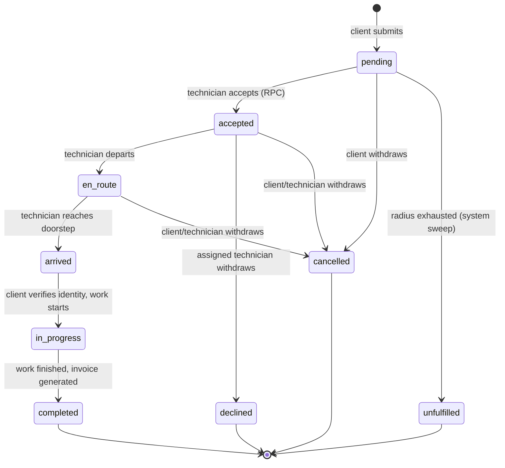
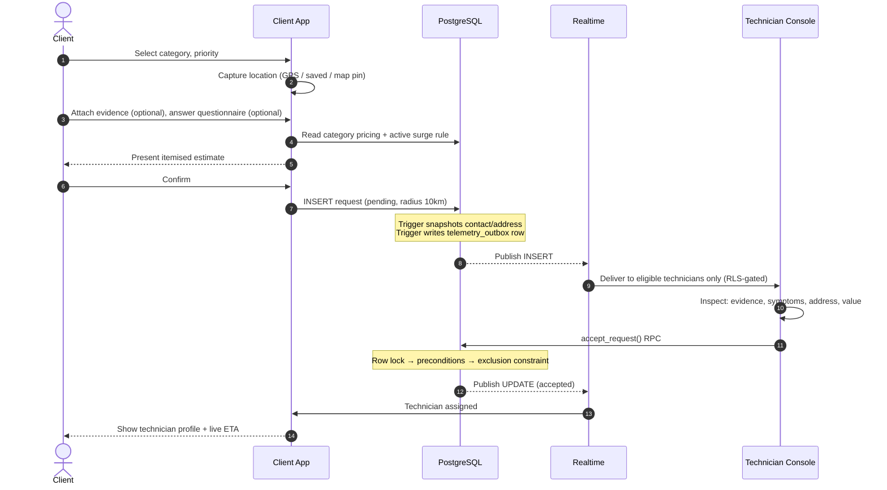
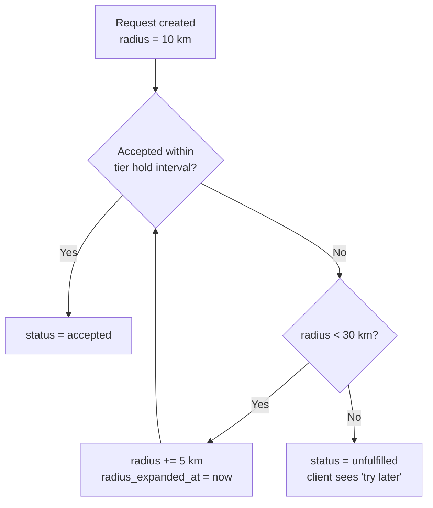
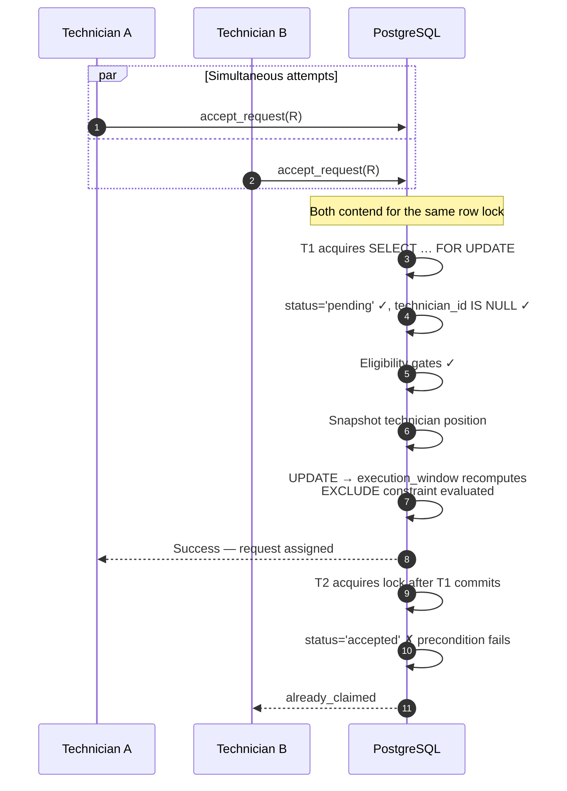
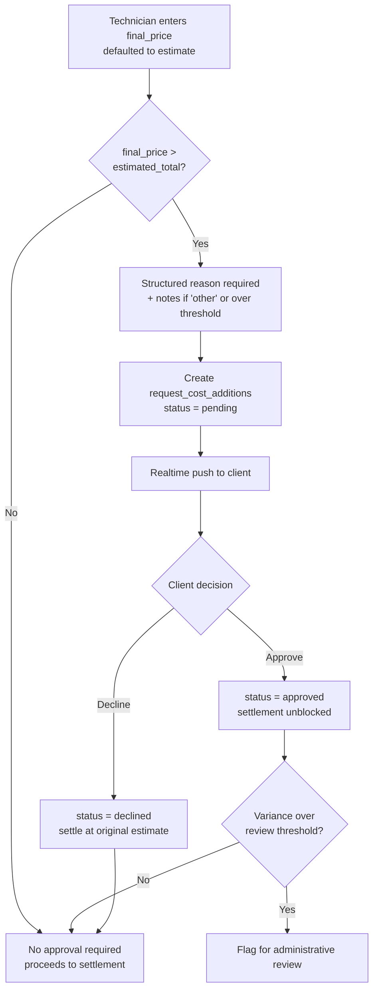
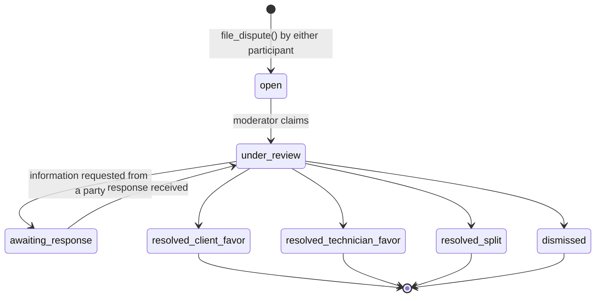
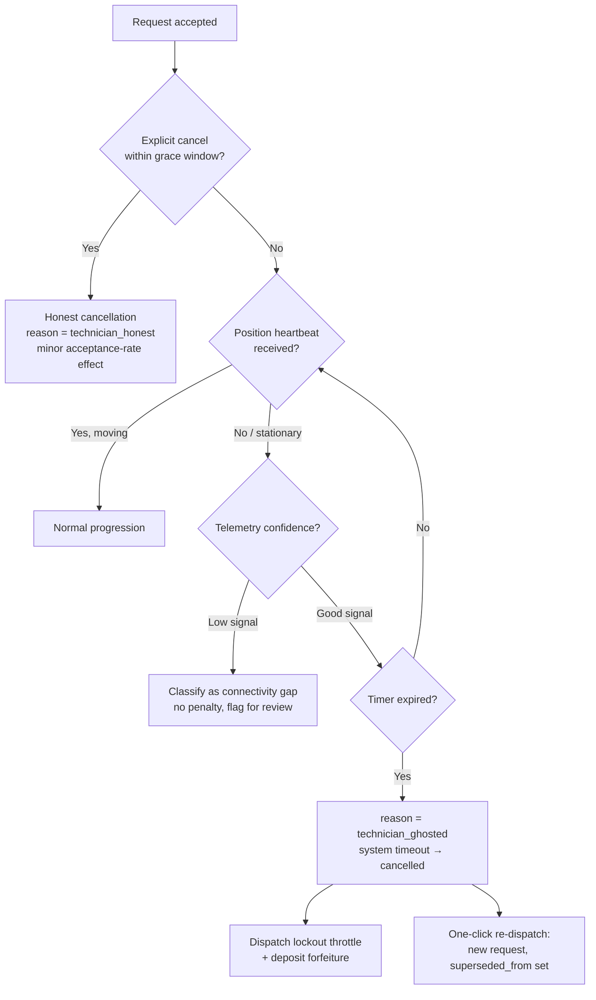

# Workflows and State Machines — SewaSync

**Document ID**: SWS-WF-001
**Version**: 1.0
**Status**: Baseline for review
**Scope**: Lifecycle state machines, dispatch algorithms, settlement and mediation flows.

> Structures referenced here are specified in `DATABASE.md`; numeric thresholds and scoring formulas in `RULES_AND_LOGIC.md`; administrative surfaces in `ADMIN_CONSOLE.md`.

---

## 1. Request Lifecycle State Machine

### 1.1 States

Nine states. Five are active, four terminal.

| State | Class | Meaning |
|---|---|---|
| `pending` | Active | Created, awaiting acceptance. Visible to eligible technicians within the current search radius |
| `accepted` | Active | Claimed by exactly one technician; calendar committed |
| `en_route` | Active | Technician travelling to the service location |
| `arrived` | Active | Technician at the doorstep, awaiting client verification |
| `in_progress` | Active | Work underway |
| `completed` | Terminal | Work finished; invoice generated |
| `cancelled` | Terminal | Withdrawn by the client (or by the technician before travel) |
| `declined` | Terminal | An already-assigned technician withdrew before starting work |
| `unfulfilled` | Terminal | Dispatch search exhausted without any acceptance |

**On the ninth state.** The original model specified eight. Radius exhaustion produces an outcome that is neither `cancelled` (no one withdrew) nor `declined` (no specific technician refused). Folding it into either misattributes agency and corrupts every downstream cancellation metric. `unfulfilled` exists so the "please try again later" outcome is distinguishable in analytics, in disputes and in the client's own history.

**On `declined`, redefined.** In the prototype, a technician pressing "Decline" mutated the single global job to `declined`. Under radius-broadcast dispatch, multiple technicians see one pending request simultaneously; one technician passing must not remove it from everyone else's feed. That behaviour now lives in `request_technician_dismissals` — a private, additive record that never touches global state. `declined` is reserved for the narrower case: an assigned technician withdrawing after acceptance.

### 1.2 Transition matrix

Rows are origin states, columns destinations. ✅ = permitted, ✗ = rejected with a diagnostic error.

| From ↓ / To → | pending | accepted | en_route | arrived | in_progress | completed | cancelled | declined | unfulfilled |
|---|---|---|---|---|---|---|---|---|---|
| **pending** | — | ✅ technician | ✗ | ✗ | ✗ | ✗ | ✅ client | ✗ | ✅ system |
| **accepted** | ✗ | — | ✅ technician | ✗ | ✗ | ✗ | ✅ client/tech | ✅ technician | ✗ |
| **en_route** | ✗ | ✗ | — | ✅ technician | ✗ | ✗ | ✅ client/tech | ✗ | ✗ |
| **arrived** | ✗ | ✗ | ✗ | — | ✅ technician | ✗ | ✗ | ✗ | ✗ |
| **in_progress** | ✗ | ✗ | ✗ | ✗ | — | ✅ technician | ✗ | ✗ | ✗ |
| **completed / cancelled / declined / unfulfilled** | ✗ — terminal, no outgoing transitions | | | | | | | | |

Notes on specific cells:

- `arrived` and `in_progress` are **not** client-cancellable. Work may already be underway and billable; withdrawal at that point is a dispute, not a cancellation. An administrative override exists but is audited as such.
- `pending → unfulfilled` is reachable only by the scheduled sweep, never by a participant.
- Terminal rows are never reopened. Re-dispatch creates a new request carrying `superseded_from_request_id`, preserving an immutable history of what actually happened.

### 1.3 Legacy vocabulary retirement

The prototype carried three overlapping enumerations (`DispatchStatus`, `JobStatus`, `ExecutionStep`) reconciled by a hand-written mapping function. All three collapse onto the canonical enum:

| `DispatchStatus` | `JobStatus` | `ExecutionStep` | Canonical |
|---|---|---|---|
| `requested`, `searching` | `PENDING_TECHNICIAN_ACCEPTANCE` | — | `pending` |
| `accepted` | `ACCEPTED` | `accepted` | `accepted` |
| `en-route` | `ON_THE_WAY` | `en-route` | `en_route` |
| `arrived` | `ARRIVED` | `arrived` | `arrived` |
| `in-progress` | `IN_PROGRESS` | `in-progress` | `in_progress` |
| `completed` | `COMPLETED` | `completed` | `completed` |
| `cancelled` | `CANCELLED` | — | `cancelled` |
| `declined` | `DECLINED` | — | `declined` (redefined) |
| *(none)* | *(none)* | *(none)* | `unfulfilled` (new) |

---

## 2. Emergency (SOS) Request Flow

**Intake steps and their persistence:**

| Step | Captured | Persisted to |
|---|---|---|
| Service selection | Category | `requests.category_id` |
| Priority triage | low / medium / high | `requests.priority` |
| Location confirmation | Geographic point + address text | `requests.service_location`, `address_line`, `area` |
| Evidence capture | Photos/video | `sos-media` bucket + `request_attachments` (`phase='pre_work'`) |
| Symptom tags & description | Multi-select + free text | `requests.symptoms`, `requests.description` |
| Questionnaire | Diagnostic answers | `request_answers` — **front-end wiring required; currently discarded in local state** |
| Price review | Base + emergency fee + tax + surge | `requests.estimated_total`, `surge_multiplier_applied` |

Evidence and questionnaire steps are skippable by design (NFR-USE-001); a person in an emergency must be able to complete submission in seconds.

---

## 3. Scheduled Booking Flow

1. Client selects a category, then a named offering (price and duration range shown).
2. Client selects a date and time slot.
3. Client confirms a service address.
4. Price review: offering price + platform fee; no emergency fee applies.
5. Insert with `scheduled_at` set and `offering_id` bound; `estimated_duration_minutes` snapshotted from the offering.

Differences from the emergency path:

| Aspect | Emergency | Scheduled |
|---|---|---|
| `scheduled_at` | NULL | Set |
| `priority` | Required | Not applicable |
| Radius behaviour | Steps 10 → 30 km on a chrono | Fixed wider radius; no urgency stepping |
| Concurrency | Single active commitment | Multiple accepted bookings permitted if windows do not overlap |
| Unfulfilment trigger | Radius exhausted | Cutoff reached before `scheduled_at` without acceptance |
| Execution window | `[accepted_at, ∞)` | `[scheduled_at, scheduled_at + duration)` |

---

## 4. Family (Delegated) Request Flow

1. Client selects a family member as beneficiary.
2. The system resolves the beneficiary's address and contact details.
3. On insert, `family_member_id` is set and `saved_address_id` must be NULL (mutual exclusivity CHECK).
4. The `snapshot_request_contact` trigger populates `contact_name` / `contact_phone` **from the family member**, not the client.
5. Dispatch, tracking and technician contact all operate against the beneficiary's details; billing remains against `client_id`.

The beneficiary never authenticates and has no read path into the system. The UI copy promising an SMS notification implies a future authentication-free tracking link — deferred, not designed (see `SRS.md` §6).

---

## 5. Notification Triggers

| Event | Notification type | Recipient |
|---|---|---|
| Request accepted | `status_update` | Client |
| Technician within proximity threshold | `eta_update` | Client |
| Status → `arrived` | `arrival` | Client |
| Cost addition created | `approval_request` | Client |
| Invoice generated | `invoice_ready` | Client |
| Scheduled booking confirmed | `booking_confirmed` | Client |
| New eligible pending request | Realtime feed (not a stored notification) | Technician |

---

## 6. Dispatch Algorithm

### 6.1 Two-phase evaluation

Dispatch is strictly two-phase, and the ordering is a safety property rather than an optimisation:

**Phase 1 — hard eligibility gates.** A technician failing any gate is removed from the candidate set entirely. No score can restore them.

| Gate | Condition |
|---|---|
| Category match | Row exists in `technician_categories` for the request's category |
| Availability | `is_online = true` |
| Calendar | No non-terminal request whose `execution_window` overlaps |
| Throttle | No active row in `technician_dispatch_throttles` |
| Proximity | `ST_DWithin(position, service_location, search_radius_km × 1000)` |
| Tooling | All mandatory tools for the category attested and unexpired |
| Insurance | For tier-2/3 categories: active policy or adequate guarantee deposit |
| Exploration gate | Unproven technicians excluded for `priority='high'` and for above-threshold difficulty |

**Phase 2 — weighted ranking** of survivors, per `RULES_AND_LOGIC.md` §7.

The invariant that matters: **equity, exploration and fairness adjustments operate only within the already-safe set.** They can reorder candidates; they can never admit an ineligible one, and they can never delay a high-priority emergency past its arrival-time ceiling.

### 6.2 Stepped radius expansion

Tiers: 10 → 15 → 20 → 25 → 30 km. Each tier is held for a configurable interval (default 2 minutes for emergencies) before expansion. Worst case is therefore roughly ten minutes from submission to `unfulfilled`.

### 6.3 Who advances the timer

PostgreSQL cannot self-trigger on elapsed time; something must ask "which pending rows are stale". Options evaluated:

| Option | Verdict |
|---|---|
| Client-side countdown calling an RPC | **Rejected** — makes lifecycle progression depend on a browser tab staying open and honest |
| External worker/cron service | Workable, but adds a deployable component to monitor |
| Scheduled Edge Function | Workable; adds a network hop to perform what is fundamentally a row-locking SQL sweep |
| **`pg_cron` sweep** | **Adopted** — co-located with the data, same locking discipline as the RPCs, no extra component, timer state cannot drift from the authoritative store |

The sweep runs every 30–60 seconds against the partial index on `radius_expanded_at`, touching only stale pending rows. It is idempotent and safe to re-run. Scheduled bookings are handled by the same job under a different predicate (approaching `scheduled_at` without acceptance).

### 6.4 Sweep versus acceptance race

Both the sweep and `accept_request()` take a row lock before re-checking `status='pending'`. Whichever acquires the lock first wins; the loser's precondition check fails cleanly. A request cannot be simultaneously accepted and marked unfulfilled.

---

## 7. Atomic Acceptance

The failure taxonomy is deliberately granular so the console can say something true:

| Exception | Meaning | UI message |
|---|---|---|
| `already_claimed` | Another technician won the race | "This job was just accepted by someone else" |
| `scheduling_conflict` | Exclusion constraint rejected the write | "This overlaps a job you've already committed to" |
| `ineligible_throttled` | Active throttle (fatigue, lockout, suspension) | "You're currently paused from new dispatch" |
| `ineligible_uninsured` | Tier-2/3 without coverage or deposit | "This job tier requires active coverage" |
| `ineligible_tooling` | Mandatory tool unattested or expired | "Re-attest your tools to take this job type" |
| `category_mismatch` | Category outside registered capability | "This job isn't in your registered services" |

---

## 8. Live Tracking

1. On acceptance, the technician console begins position broadcast: `watchPosition` with high accuracy, throttled to roughly 5-second intervals during movement, with a ~15-second stationary heartbeat.
2. Each report **upserts** `technician_locations` (current-position cache, one row per technician) **and appends** to `technician_location_pings` (trajectory history). These are two different tables serving two different purposes — see `DATABASE.md` §5.5.
3. Realtime propagates the `technician_locations` change to the client, gated by the RLS policy that permits reading only the technician assigned to the client's own request.
4. The client computes distance (haversine) and ETA from distance against a configurable urban travel-speed assumption.
5. Within a proximity threshold, the display switches from numeric ETA to an arrival-imminent state.
6. On terminal status, broadcast stops and the current-position row's `request_id` is cleared.

Telemetry confidence (see `RULES_AND_LOGIC.md` §9.9) is computed per trip from ping density and gates whether the trajectory is admitted into performance scoring at all.

---

## 9. Price Variance and Approval

The enforcement point is `settle_job_payment()`. It refuses to write while a matching cost addition is still `pending`, raising `cost_addition_not_approved` rather than writing a partial result — and `advance_request_status()` will not transition to `completed` while an unsettled addition exists. A downward variance needs no approval; charging less than quoted is never a dispute.

---

## 10. Settlement and Payout

1. Technician submits `final_price` with reason and notes as required.
2. `settle_job_payment()` validates the approval invariant (§9), resolves the `commission_rules` row effective at that moment, and writes `final_price` plus the adjustment metadata.
3. Status advances to `completed`; the completion trigger generates the invoice: one line for the base service, one per approved cost addition, plus tax.
4. A `technician_payouts` row is created: gross = final price, less commission, less any penalty deductions, giving net.
5. Payment reconciliation proceeds by method:

| Method | Path | Failure semantics |
|---|---|---|
| UPI | `pending → processing → succeeded/failed` | Collect-request timeout, PSP decline and insufficient funds are distinct outcomes with different retry semantics |
| Card / net banking | `pending → processing → succeeded/failed` | Gateway callback-driven |
| Cash | `pending → succeeded` on technician attestation | No gateway; attestation carries different fraud characteristics and is weighted accordingly in trust scoring |

6. If an active escrow hold exists against the request or an associated dispute, payout status is `held` rather than `pending` until the hold is released.

An invoice is settled when at least one `succeeded` payment covers its total — computed, not stored as a redundant flag.

---

## 11. Dispute and Mediation Flow

**Properties:**

- At most one active dispute per request (partial unique constraint); resolved history is retained.
- Filing does **not** alter request lifecycle state. Evidence-gathering and dispatch progression are independent concerns.
- Resolution is atomic: it sets the outcome, allocates liability, applies the consequent escrow/refund/payout adjustment, and writes an `admin_actions` record with mandatory justification — all in one transaction.
- Resolution deliberately does **not** apply technician throttles. Suspending a technician is a separate administrative decision with its own audit record, so that "who resolved the dispute" and "who suspended the worker" are independently answerable.
- Outcomes feed both the technician capability score and the client trust profile.

---

## 12. Ghosting Detection and Re-dispatch

The telemetry-confidence branch is what prevents the detector from punishing a technician whose budget device lost signal in a basement. A stationary position under degraded telemetry is a materially different fact from a stationary position under good telemetry, and the system must not conflate them.

Re-dispatch creates a **new** request referencing the original rather than reopening a terminal row — the audit trail stays truthful about what happened to the first attempt.

---

## 13. Review Flow

1. On completion, the client is prompted (skippable) for a star rating, optional attribute tags, optional free text and an optional gratuity.
2. Insert is permitted only when the request is `completed` and the caller is its client; `UNIQUE(request_id)` enforces one review per job.
3. An `AFTER INSERT` trigger recomputes that technician's `rating` and `review_count` using the **cached** baseline values — not by recomputing the global mean, which would make every technician's displayed score jitter on every unrelated review platform-wide.
4. A nightly job refreshes `platform_rating_baseline` from the full review population.

Formula and parameters: `RULES_AND_LOGIC.md` §4.

---

## 14. Scheduled Background Jobs

| Job | Cadence | Action |
|---|---|---|
| Radius expansion sweep | 30–60 s | Expand tier or mark `unfulfilled`; also handles scheduled-booking cutoffs |
| Duty ledger refresh | ~5 min | Recompute active minutes and streaks; apply/lift fatigue throttles |
| Outbox drain | Continuous (worker) | Batch to Redis Streams, compact to Parquet, upload |
| Rating baseline refresh | Nightly | Recompute global mean and sample size |
| Trust and capability rollups | Nightly | Recompute client trust bands, technician capability composites |
| Pair-frequency analysis | Nightly | Recompute collusion deviation scores, promote flags |
| Verification expiry sweep | Nightly | Expire lapsed KYC, insurance and tooling attestations; re-engage gates |
| Partition maintenance | Weekly/monthly | Create upcoming partitions; detach, drain and drop aged ones |
| Gini monitoring | Nightly | Compute platform-wide assignment-equity metric for the dashboard |

All jobs are idempotent. All jobs that mutate request state use the same row-locking discipline as the RPCs.
